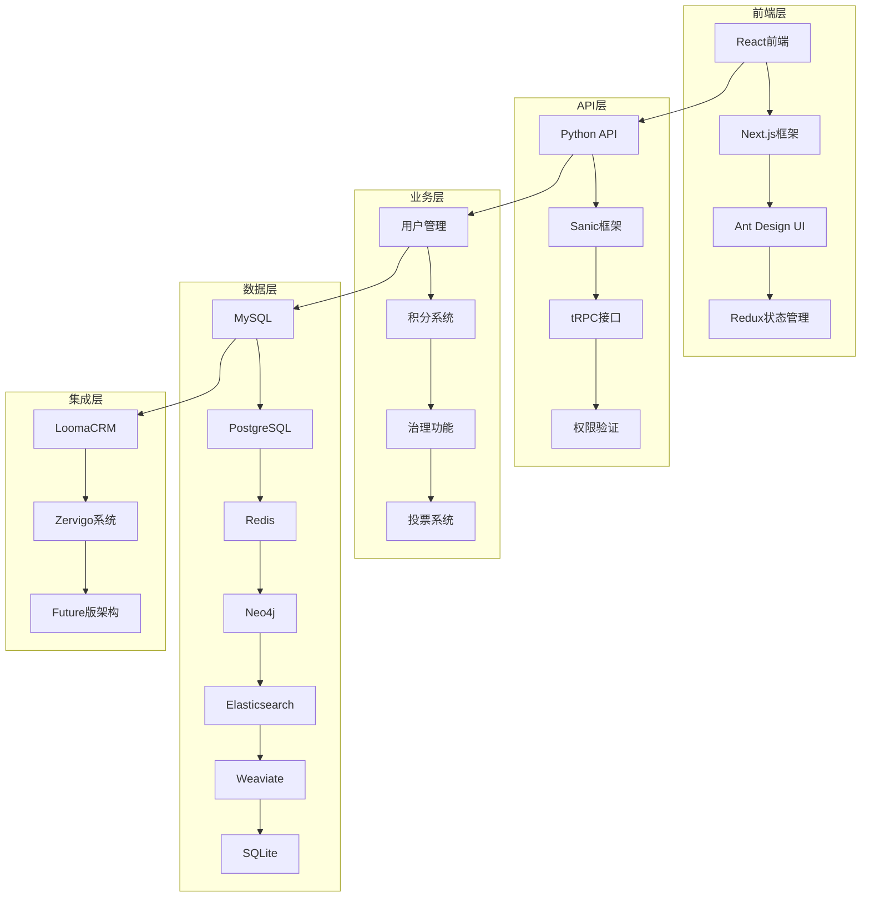

# 积分制DAO版技术架构文档

## 🎯 架构概述

**创建时间**: 2025年10月6日  
**架构目标**: 积分制DAO版技术架构设计  
**架构基础**: 多数据库架构 + LoomaCRM + Zervigo系统 + Future版经验  
**架构状态**: 技术架构设计完成

## 🏗️ 整体架构设计

### 1. 系统架构图



### 2. 技术栈选择

#### 前端技术栈
```yaml
框架: React 18.3.1
构建工具: Next.js 14.2.4
UI组件: Ant Design 5.x
状态管理: Redux Toolkit
样式: Tailwind CSS 3.4.3
图表: Chart.js
类型检查: TypeScript 5.5.3
```

#### 后端技术栈
```yaml
框架: Python 3.11
Web框架: Sanic 23.x
API框架: tRPC
数据库ORM: Prisma
认证: JWT + bcrypt
缓存: Redis
搜索: Elasticsearch
图数据库: Neo4j
向量数据库: Weaviate
```

#### 部署技术栈
```yaml
容器化: Docker + Docker Compose
监控: Prometheus + Grafana
日志: ELK Stack
反向代理: Nginx
负载均衡: Nginx
```

## 🗄️ 数据库架构设计

### 1. 多数据库架构

#### MySQL数据库 (用户数据)
```sql
-- 用户表
CREATE TABLE users (
    id INT PRIMARY KEY AUTO_INCREMENT,
    username VARCHAR(50) UNIQUE NOT NULL,
    email VARCHAR(100) UNIQUE NOT NULL,
    password_hash VARCHAR(255) NOT NULL,
    created_at TIMESTAMP DEFAULT CURRENT_TIMESTAMP,
    updated_at TIMESTAMP DEFAULT CURRENT_TIMESTAMP ON UPDATE CURRENT_TIMESTAMP
);

-- DAO组织表
CREATE TABLE dao_organizations (
    id INT PRIMARY KEY AUTO_INCREMENT,
    name VARCHAR(100) NOT NULL,
    description TEXT,
    creator_id INT,
    governance_token VARCHAR(100),
    voting_threshold DECIMAL(5,2) DEFAULT 50.00,
    created_at TIMESTAMP DEFAULT CURRENT_TIMESTAMP,
    FOREIGN KEY (creator_id) REFERENCES users(id)
);
```

#### PostgreSQL数据库 (治理数据)
```sql
-- DAO成员表
CREATE TABLE dao_members (
    id SERIAL PRIMARY KEY,
    user_id VARCHAR(255) NOT NULL,
    dao_id INT NOT NULL,
    reputation_score INT DEFAULT 0,
    contribution_points INT DEFAULT 0,
    voting_power INT DEFAULT 0,
    governance_level VARCHAR(20) DEFAULT 'member',
    joined_at TIMESTAMP DEFAULT CURRENT_TIMESTAMP
);

-- DAO提案表
CREATE TABLE dao_proposals (
    id SERIAL PRIMARY KEY,
    organization_id INT,
    proposer_id INT,
    title VARCHAR(200) NOT NULL,
    description TEXT,
    proposal_type VARCHAR(20),
    status VARCHAR(20),
    voting_start TIMESTAMP,
    voting_end TIMESTAMP,
    created_at TIMESTAMP DEFAULT CURRENT_TIMESTAMP
);

-- DAO投票表
CREATE TABLE dao_votes (
    id SERIAL PRIMARY KEY,
    proposal_id INT NOT NULL,
    voter_id VARCHAR(255) NOT NULL,
    voting_power INT NOT NULL,
    vote_choice VARCHAR(10) NOT NULL,
    voted_at TIMESTAMP DEFAULT CURRENT_TIMESTAMP
);
```

#### Redis数据库 (缓存数据)
```yaml
缓存策略:
  用户会话: user:session:{user_id}
  积分缓存: points:{user_id}:{dao_id}
  投票缓存: vote:{proposal_id}
  搜索结果: search:{query_hash}
  
过期时间:
  用户会话: 24小时
  积分缓存: 1小时
  投票缓存: 7天
  搜索结果: 30分钟
```

#### Neo4j数据库 (关系数据)
```cypher
// 用户关系
CREATE (u:User {id: 'user_1', name: 'Alice'})
CREATE (d:DAO {id: 'dao_1', name: 'TechDAO'})
CREATE (u)-[:MEMBER_OF]->(d)
CREATE (u)-[:VOTED_ON]->(p:Proposal {id: 'proposal_1'})

// 治理关系
CREATE (u1:User)-[:DELEGATES_TO]->(u2:User)
CREATE (u1)-[:COLLABORATES_WITH]->(u2)
```

#### Elasticsearch数据库 (搜索数据)
```json
{
  "mappings": {
    "properties": {
      "proposal_id": {"type": "integer"},
      "title": {"type": "text", "analyzer": "ik_max_word"},
      "description": {"type": "text", "analyzer": "ik_max_word"},
      "tags": {"type": "keyword"},
      "created_at": {"type": "date"},
      "author": {"type": "keyword"}
    }
  }
}
```

#### Weaviate数据库 (向量数据)
```json
{
  "class": "DAOProposal",
  "description": "DAO提案向量化存储",
  "properties": [
    {
      "name": "title",
      "dataType": ["text"]
    },
    {
      "name": "description",
      "dataType": ["text"]
    },
    {
      "name": "embedding",
      "dataType": ["number[]"]
    }
  ]
}
```

#### SQLite数据库 (个人数据)
```sql
-- 用户个人数据
CREATE TABLE user_profiles (
    user_id VARCHAR(255) PRIMARY KEY,
    avatar_url VARCHAR(500),
    bio TEXT,
    preferences JSON,
    created_at TIMESTAMP DEFAULT CURRENT_TIMESTAMP
);

-- 用户个人设置
CREATE TABLE user_settings (
    user_id VARCHAR(255) PRIMARY KEY,
    notification_preferences JSON,
    privacy_settings JSON,
    theme_preferences JSON
);
```

### 2. 数据库关系设计

#### 核心实体关系
```yaml
用户 (User):
  - 基本信息: MySQL
  - 个人数据: SQLite
  - 会话数据: Redis
  - 关系数据: Neo4j

DAO组织 (DAO):
  - 基本信息: MySQL
  - 治理数据: PostgreSQL
  - 搜索数据: Elasticsearch
  - 向量数据: Weaviate

提案 (Proposal):
  - 基本信息: PostgreSQL
  - 搜索数据: Elasticsearch
  - 向量数据: Weaviate
  - 缓存数据: Redis

投票 (Vote):
  - 投票数据: PostgreSQL
  - 缓存数据: Redis
  - 关系数据: Neo4j
```

## 🔧 系统集成架构

### 1. LoomaCRM集成

#### 集成方案
```yaml
数据同步:
  - 用户数据同步
  - 客户关系管理
  - 业务流程集成
  
API集成:
  - 用户认证集成
  - 权限管理集成
  - 数据同步API
```

#### 集成代码
```python
# LoomaCRM集成服务
class LoomaCRMIntegration:
    def __init__(self):
        self.client = LoomaCRMClient()
    
    def sync_user_data(self, user_id):
        # 同步用户数据
        pass
    
    def sync_customer_data(self, customer_id):
        # 同步客户数据
        pass
    
    def sync_business_process(self, process_id):
        # 同步业务流程
        pass
```

### 2. Zervigo系统集成

#### 集成方案
```yaml
权限管理:
  - 角色管理集成
  - 权限验证集成
  - 用户管理集成
  
系统集成:
  - 用户认证集成
  - 权限控制集成
  - 数据访问控制
```

#### 集成代码
```python
# Zervigo系统集成服务
class ZervigoIntegration:
    def __init__(self):
        self.client = ZervigoClient()
    
    def check_permission(self, user_id, resource, action):
        # 检查权限
        pass
    
    def get_user_roles(self, user_id):
        # 获取用户角色
        pass
    
    def assign_role(self, user_id, role):
        # 分配角色
        pass
```

### 3. Future版架构集成

#### 集成方案
```yaml
多数据库集成:
  - MySQL集成
  - PostgreSQL集成
  - Redis集成
  - Neo4j集成
  - Elasticsearch集成
  - Weaviate集成
  - SQLite集成
  
容器化集成:
  - Docker容器化
  - Docker Compose编排
  - 监控系统集成
  - 日志系统集成
```

## 🚀 部署架构设计

### 1. 容器化部署

#### Docker Compose配置
```yaml
version: '3.8'
services:
  # 数据库服务
  dao-mysql:
    image: mysql:8.0
    environment:
      MYSQL_ROOT_PASSWORD: ${MYSQL_ROOT_PASSWORD}
      MYSQL_DATABASE: ${MYSQL_DATABASE}
      MYSQL_USER: ${MYSQL_USER}
      MYSQL_PASSWORD: ${MYSQL_PASSWORD}
    ports:
      - "3306:3306"
    volumes:
      - dao_mysql_data:/var/lib/mysql

  dao-postgresql:
    image: postgres:15
    environment:
      POSTGRES_DB: ${POSTGRES_DB}
      POSTGRES_USER: ${POSTGRES_USER}
      POSTGRES_PASSWORD: ${POSTGRES_PASSWORD}
    ports:
      - "5432:5432"
    volumes:
      - dao_postgresql_data:/var/lib/postgresql/data

  dao-redis:
    image: redis:7-alpine
    command: redis-server --requirepass ${REDIS_PASSWORD}
    ports:
      - "6379:6379"
    volumes:
      - dao_redis_data:/data

  dao-neo4j:
    image: neo4j:5.15.0
    environment:
      NEO4J_AUTH: neo4j/${NEO4J_PASSWORD}
    ports:
      - "7474:7474"
      - "7687:7687"
    volumes:
      - dao_neo4j_data:/data

  dao-elasticsearch:
    image: elasticsearch:7.17.9
    environment:
      - discovery.type=single-node
    ports:
      - "9200:9200"
    volumes:
      - dao_elasticsearch_data:/usr/share/elasticsearch/data

  dao-weaviate:
    image: semitechnologies/weaviate:1.21.0
    ports:
      - "8080:8080"
    volumes:
      - dao_weaviate_data:/var/lib/weaviate

  # 应用服务
  dao-backend:
    build: ./backend
    ports:
      - "8000:8000"
    depends_on:
      - dao-mysql
      - dao-postgresql
      - dao-redis
      - dao-neo4j
      - dao-elasticsearch
      - dao-weaviate

  dao-frontend:
    build: ./frontend
    ports:
      - "3000:3000"
    depends_on:
      - dao-backend

volumes:
  dao_mysql_data:
  dao_postgresql_data:
  dao_redis_data:
  dao_neo4j_data:
  dao_elasticsearch_data:
  dao_weaviate_data:
```

### 2. 监控架构

#### Prometheus配置
```yaml
# prometheus.yml
global:
  scrape_interval: 15s

scrape_configs:
  - job_name: 'dao-backend'
    static_configs:
      - targets: ['dao-backend:8000']
  
  - job_name: 'dao-mysql'
    static_configs:
      - targets: ['dao-mysql:3306']
  
  - job_name: 'dao-postgresql'
    static_configs:
      - targets: ['dao-postgresql:5432']
  
  - job_name: 'dao-redis'
    static_configs:
      - targets: ['dao-redis:6379']
```

#### Grafana配置
```yaml
# grafana配置
dashboards:
  - dao_overview:
      title: "DAO系统概览"
      panels:
        - user_activity
        - voting_statistics
        - database_performance
        - system_health
  
  - database_performance:
      title: "数据库性能"
      panels:
        - mysql_performance
        - postgresql_performance
        - redis_performance
        - neo4j_performance
```

### 3. 日志架构

#### ELK Stack配置
```yaml
# logstash配置
input {
  beats {
    port => 5044
  }
}

filter {
  if [fields][service] == "dao-backend" {
    grok {
      match => { "message" => "%{TIMESTAMP_ISO8601:timestamp} %{LOGLEVEL:level} %{GREEDYDATA:message}" }
    }
  }
}

output {
  elasticsearch {
    hosts => ["dao-elasticsearch:9200"]
    index => "dao-logs-%{+YYYY.MM.dd}"
  }
}
```

## 📊 性能优化架构

### 1. 缓存策略

#### Redis缓存设计
```python
# 缓存策略
class CacheStrategy:
    def __init__(self):
        self.redis = redis.Redis(host='dao-redis', port=6379, db=0)
    
    def cache_user_session(self, user_id, session_data):
        # 缓存用户会话
        key = f"user:session:{user_id}"
        self.redis.setex(key, 86400, json.dumps(session_data))
    
    def cache_points(self, user_id, dao_id, points_data):
        # 缓存积分数据
        key = f"points:{user_id}:{dao_id}"
        self.redis.setex(key, 3600, json.dumps(points_data))
    
    def cache_vote_result(self, proposal_id, result):
        # 缓存投票结果
        key = f"vote:result:{proposal_id}"
        self.redis.setex(key, 604800, json.dumps(result))
```

### 2. 数据库优化

#### 索引优化
```sql
-- MySQL索引
CREATE INDEX idx_users_email ON users(email);
CREATE INDEX idx_dao_orgs_creator ON dao_organizations(creator_id);

-- PostgreSQL索引
CREATE INDEX idx_dao_members_user_dao ON dao_members(user_id, dao_id);
CREATE INDEX idx_dao_proposals_org_status ON dao_proposals(organization_id, status);
CREATE INDEX idx_dao_votes_proposal ON dao_votes(proposal_id);
```

#### 查询优化
```python
# 查询优化
class QueryOptimizer:
    def __init__(self):
        self.mysql = MySQLConnection()
        self.postgresql = PostgreSQLConnection()
        self.redis = RedisConnection()
    
    def get_user_with_points(self, user_id, dao_id):
        # 优化用户积分查询
        cache_key = f"user:points:{user_id}:{dao_id}"
        cached = self.redis.get(cache_key)
        if cached:
            return json.loads(cached)
        
        # 从数据库查询
        result = self.postgresql.query(
            "SELECT * FROM dao_members WHERE user_id = %s AND dao_id = %s",
            (user_id, dao_id)
        )
        
        # 缓存结果
        self.redis.setex(cache_key, 3600, json.dumps(result))
        return result
```

### 3. 搜索优化

#### Elasticsearch优化
```json
{
  "settings": {
    "number_of_shards": 3,
    "number_of_replicas": 1,
    "analysis": {
      "analyzer": {
        "dao_analyzer": {
          "type": "custom",
          "tokenizer": "ik_max_word",
          "filter": ["lowercase", "stop"]
        }
      }
    }
  }
}
```

## 📞 总结

### ✅ 架构优势
- **多数据库支持**: 完整的多数据库架构
- **系统集成**: 与LoomaCRM和Zervigo系统深度集成
- **性能优化**: 完善的缓存和查询优化
- **监控完善**: 完整的监控和日志系统

### 🚀 技术特点
- **可扩展性**: 支持水平扩展
- **高可用性**: 多数据库容错
- **性能优化**: 缓存和查询优化
- **监控完善**: 实时监控和告警

### 💡 实施建议
1. **分阶段实施**: 按照架构设计分阶段实施
2. **性能测试**: 每个阶段都要进行性能测试
3. **监控部署**: 部署完整的监控系统
4. **持续优化**: 根据监控数据持续优化

**💪 基于多数据库架构和成熟的系统集成经验，我们有信心构建一个高性能、高可用的积分制DAO治理系统！** 🎉

---
*文档创建时间: 2025年10月6日*  
*文档目标: 积分制DAO版技术架构设计*  
*文档状态: 技术架构设计完成*  
*下一步: 开始技术架构实施*
