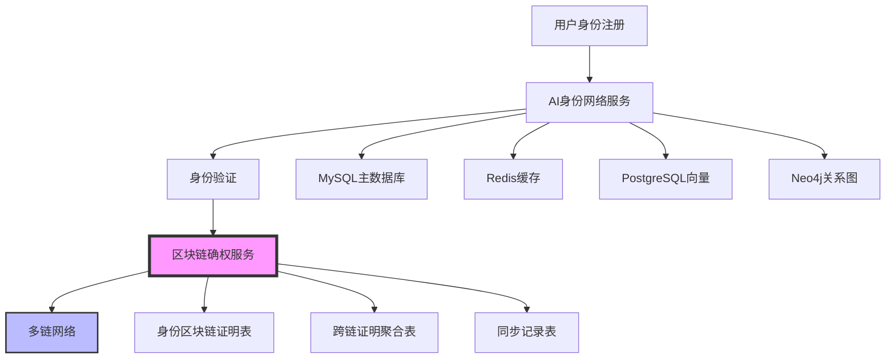

# AI身份网络与区块链集成对多数据库架构影响分析

## 概述

分析AI身份网络与区块链集成对现有多数据库架构的影响，包括数据同步、一致性保证、性能优化和架构扩展。

## 🏗️ 现有多数据库架构分析

### ✅ 当前多数据库架构 (10个数据库)

#### 基础设施数据库 (5个)
1. **MySQL**:3306 - 主数据库 (jobfirst)
2. **Redis**:6382 - 缓存服务
3. **PostgreSQL**:5434 - 向量数据库 (jobfirst_future)
4. **Neo4j**:7687 - 图数据库 (jobfirst-future)
5. **Elasticsearch**:9202 - 搜索引擎

#### 业务数据库 (3个)
6. **MongoDB**:27018 - 文档数据库 (jobfirst_future)
7. **Weaviate**:8082 - 向量数据库 (jobfirst_future)
8. **DAO MySQL**:9506 - DAO治理系统 (dao_dev)

#### 新增数据库 (2个)
9. **AI身份网络服务**:8083 - AI身份验证服务
10. **AI服务数据库**:5435 - AI模型数据存储 (ai_identity_network)

### 🎯 数据库架构特点
- **多数据库架构**: 10个不同类型的数据库
- **数据一致性**: 通过应用层保证数据一致性
- **服务解耦**: 每个服务独立管理自己的数据
- **缓存策略**: Redis作为统一缓存层

## 🚀 区块链集成对多数据库的影响

### 1. 新增数据库表和结构

#### 1.1 身份区块链相关表 (MySQL主数据库)
```sql
-- 身份区块链证明表
CREATE TABLE identity_blockchain_proofs (
    id BIGINT PRIMARY KEY AUTO_INCREMENT,
    user_id VARCHAR(255) NOT NULL COMMENT '用户ID',
    proof_type VARCHAR(50) NOT NULL COMMENT '证明类型 (identity_registration, resume_upload, skill_verification, experience_verification, achievement_record)',
    proof_data JSON NOT NULL COMMENT '证明数据',
    blockchain_tx_hash VARCHAR(255) NOT NULL COMMENT '区块链交易哈希',
    chain_type VARCHAR(50) NOT NULL COMMENT '链类型 (hw, eth, fisco, polygon)',
    block_number BIGINT COMMENT '区块号',
    verification_status ENUM('PENDING', 'CONFIRMED', 'FAILED') DEFAULT 'PENDING',
    verification_score FLOAT COMMENT '验证评分',
    created_at TIMESTAMP DEFAULT CURRENT_TIMESTAMP,
    updated_at TIMESTAMP DEFAULT CURRENT_TIMESTAMP ON UPDATE CURRENT_TIMESTAMP,
    INDEX idx_user_id (user_id),
    INDEX idx_proof_type (proof_type),
    INDEX idx_chain_type (chain_type),
    INDEX idx_verification_status (verification_status),
    INDEX idx_blockchain_tx_hash (blockchain_tx_hash)
) ENGINE=InnoDB DEFAULT CHARSET=utf8mb4 COLLATE=utf8mb4_unicode_ci;

-- 跨链身份证明聚合表
CREATE TABLE cross_chain_identity_proofs (
    id BIGINT PRIMARY KEY AUTO_INCREMENT,
    user_id VARCHAR(255) NOT NULL COMMENT '用户ID',
    proof_type VARCHAR(50) NOT NULL COMMENT '证明类型',
    aggregated_hash VARCHAR(255) NOT NULL COMMENT '聚合哈希',
    verification_score FLOAT NOT NULL COMMENT '综合验证评分',
    chain_proofs JSON NOT NULL COMMENT '各链证明详情',
    created_at TIMESTAMP DEFAULT CURRENT_TIMESTAMP,
    updated_at TIMESTAMP DEFAULT CURRENT_TIMESTAMP ON UPDATE CURRENT_TIMESTAMP,
    INDEX idx_user_id (user_id),
    INDEX idx_proof_type (proof_type),
    INDEX idx_aggregated_hash (aggregated_hash),
    UNIQUE KEY uk_user_proof_type (user_id, proof_type)
) ENGINE=InnoDB DEFAULT CHARSET=utf8mb4 COLLATE=utf8mb4_unicode_ci;

-- 身份验证规则表
CREATE TABLE identity_verification_rules (
    id BIGINT PRIMARY KEY AUTO_INCREMENT,
    rule_id VARCHAR(100) NOT NULL COMMENT '规则ID',
    rule_name VARCHAR(255) NOT NULL COMMENT '规则名称',
    verification_type VARCHAR(50) NOT NULL COMMENT '验证类型',
    blockchain_role VARCHAR(50) NOT NULL COMMENT '区块链角色',
    priority INT NOT NULL COMMENT '优先级',
    is_active BOOLEAN DEFAULT TRUE COMMENT '是否激活',
    rule_config JSON NOT NULL COMMENT '规则配置',
    created_at TIMESTAMP DEFAULT CURRENT_TIMESTAMP,
    updated_at TIMESTAMP DEFAULT CURRENT_TIMESTAMP ON UPDATE CURRENT_TIMESTAMP,
    INDEX idx_rule_id (rule_id),
    INDEX idx_verification_type (verification_type),
    INDEX idx_priority (priority),
    UNIQUE KEY uk_rule_id (rule_id)
) ENGINE=InnoDB DEFAULT CHARSET=utf8mb4 COLLATE=utf8mb4_unicode_ci;
```

#### 1.2 区块链同步记录表
```sql
-- 区块链同步记录表
CREATE TABLE blockchain_sync_records (
    id BIGINT PRIMARY KEY AUTO_INCREMENT,
    sync_id VARCHAR(255) NOT NULL COMMENT '同步ID',
    source_db VARCHAR(50) NOT NULL COMMENT '源数据库',
    target_db VARCHAR(50) NOT NULL COMMENT '目标数据库',
    data_type VARCHAR(100) NOT NULL COMMENT '数据类型 (identity_proof, skill_proof, experience_proof)',
    data_id VARCHAR(255) NOT NULL COMMENT '数据ID',
    blockchain_tx_hash VARCHAR(255) COMMENT '区块链交易哈希',
    sync_status ENUM('PENDING', 'SUCCESS', 'FAILED', 'RETRY') DEFAULT 'PENDING',
    sync_time TIMESTAMP DEFAULT CURRENT_TIMESTAMP,
    retry_count INT DEFAULT 0,
    error_message TEXT,
    INDEX idx_sync_id (sync_id),
    INDEX idx_source_db (source_db),
    INDEX idx_target_db (target_db),
    INDEX idx_sync_status (sync_status),
    INDEX idx_blockchain_tx_hash (blockchain_tx_hash)
) ENGINE=InnoDB DEFAULT CHARSET=utf8mb4 COLLATE=utf8mb4_unicode_ci;
```

#### 1.3 身份数据一致性检查表
```sql
-- 身份数据一致性检查表
CREATE TABLE identity_consistency_checks (
    id BIGINT PRIMARY KEY AUTO_INCREMENT,
    check_id VARCHAR(255) NOT NULL COMMENT '检查ID',
    user_id VARCHAR(255) NOT NULL COMMENT '用户ID',
    check_type VARCHAR(50) NOT NULL COMMENT '检查类型 (local, blockchain, cross_chain)',
    check_status ENUM('PENDING', 'PASSED', 'FAILED', 'WARNING') DEFAULT 'PENDING',
    check_result JSON COMMENT '检查结果',
    consistency_score FLOAT COMMENT '一致性评分',
    check_time TIMESTAMP DEFAULT CURRENT_TIMESTAMP,
    INDEX idx_check_id (check_id),
    INDEX idx_user_id (user_id),
    INDEX idx_check_type (check_type),
    INDEX idx_check_status (check_status)
) ENGINE=InnoDB DEFAULT CHARSET=utf8mb4 COLLATE=utf8mb4_unicode_ci;
```

### 2. 多数据库同步策略扩展

#### 2.1 身份数据同步流程


#### 2.2 数据同步规则扩展
```go
type IdentitySyncRule struct {
    RuleID         string
    SourceDB       DatabaseType
    TargetDB       DatabaseType
    DataType       string
    SyncTrigger    SyncTrigger
    BlockchainRole BlockchainRole
    Priority       int
}

type SyncTrigger string

const (
    SyncTriggerRealTime   SyncTrigger = "real_time"
    SyncTriggerBatch      SyncTrigger = "batch"
    SyncTriggerScheduled  SyncTrigger = "scheduled"
    SyncTriggerOnDemand   SyncTrigger = "on_demand"
)

// 身份数据同步规则
var IdentitySyncRules = []IdentitySyncRule{
    {
        RuleID:         "identity_registration_sync",
        SourceDB:       DatabaseTypeMySQL,
        TargetDB:       DatabaseTypeBlockchain,
        DataType:       "identity_proof",
        SyncTrigger:    SyncTriggerRealTime,
        BlockchainRole: RoleIdentityProof,
        Priority:       95,
    },
    {
        RuleID:         "skill_verification_sync",
        SourceDB:       DatabaseTypeMySQL,
        TargetDB:       DatabaseTypeBlockchain,
        DataType:       "skill_proof",
        SyncTrigger:    SyncTriggerRealTime,
        BlockchainRole: RoleSkillProof,
        Priority:       90,
    },
    {
        RuleID:         "experience_verification_sync",
        SourceDB:       DatabaseTypeMySQL,
        TargetDB:       DatabaseTypeBlockchain,
        DataType:       "experience_proof",
        SyncTrigger:    SyncTriggerRealTime,
        BlockchainRole: RoleExperienceProof,
        Priority:       85,
    },
    {
        RuleID:         "cross_chain_aggregation_sync",
        SourceDB:       DatabaseTypeBlockchain,
        TargetDB:       DatabaseTypeMySQL,
        DataType:       "cross_chain_proof",
        SyncTrigger:    SyncTriggerBatch,
        BlockchainRole: RoleCrossChainProof,
        Priority:       80,
    },
}
```

### 3. 数据库一致性管理扩展

#### 3.1 身份数据一致性检查器
```go
type IdentityConsistencyChecker struct {
    databases    map[DatabaseType]*DatabaseConnection
    blockchain   *BlockchainChainManager
    consistency  *ConsistencyEngine
    logger       *zap.Logger
}

func (icc *IdentityConsistencyChecker) CheckIdentityConsistency(userID string) (*IdentityConsistencyReport, error) {
    report := &IdentityConsistencyReport{
        UserID:     userID,
        CheckTime:  time.Now(),
        Checks:     make(map[string]*ConsistencyCheck),
    }
    
    // 检查本地数据库一致性
    localConsistency := icc.checkLocalIdentityConsistency(userID)
    report.Checks["local"] = localConsistency
    
    // 检查区块链一致性
    blockchainConsistency := icc.checkBlockchainIdentityConsistency(userID)
    report.Checks["blockchain"] = blockchainConsistency
    
    // 检查跨链一致性
    crossChainConsistency := icc.checkCrossChainIdentityConsistency(userID)
    report.Checks["cross_chain"] = crossChainConsistency
    
    // 计算综合一致性评分
    report.OverallScore = icc.calculateOverallConsistencyScore(report.Checks)
    
    return report, nil
}

func (icc *IdentityConsistencyChecker) checkLocalIdentityConsistency(userID string) *ConsistencyCheck {
    // 检查MySQL、PostgreSQL、Neo4j中的用户身份数据一致性
    mysqlUser, err := icc.databases[DatabaseTypeMySQL].GetUser(userID)
    if err != nil {
        return &ConsistencyCheck{Status: "FAILED", Error: err.Error()}
    }
    
    postgresUser, err := icc.databases[DatabaseTypePostgreSQL].GetUser(userID)
    if err != nil {
        return &ConsistencyCheck{Status: "FAILED", Error: err.Error()}
    }
    
    neo4jUser, err := icc.databases[DatabaseTypeNeo4j].GetUser(userID)
    if err != nil {
        return &ConsistencyCheck{Status: "FAILED", Error: err.Error()}
    }
    
    // 比较数据一致性
    if mysqlUser.Email != postgresUser.Email || mysqlUser.Email != neo4jUser.Email {
        return &ConsistencyCheck{
            Status: "FAILED",
            Error:  "用户邮箱数据不一致",
            Details: map[string]interface{}{
                "mysql":    mysqlUser.Email,
                "postgres": postgresUser.Email,
                "neo4j":    neo4jUser.Email,
            },
        }
    }
    
    return &ConsistencyCheck{Status: "PASSED", Score: 1.0}
}

func (icc *IdentityConsistencyChecker) checkBlockchainIdentityConsistency(userID string) *ConsistencyCheck {
    // 检查区块链上的身份证明数据
    proofs, err := icc.blockchain.GetUserIdentityProofs(userID)
    if err != nil {
        return &ConsistencyCheck{Status: "FAILED", Error: err.Error()}
    }
    
    // 验证区块链证明的有效性
    validProofs := 0
    totalProofs := len(proofs)
    
    for _, proof := range proofs {
        if proof.VerificationStatus == "CONFIRMED" {
            validProofs++
        }
    }
    
    consistencyScore := float64(validProofs) / float64(totalProofs)
    
    return &ConsistencyCheck{
        Status: "PASSED",
        Score:  consistencyScore,
        Details: map[string]interface{}{
            "total_proofs":  totalProofs,
            "valid_proofs":  validProofs,
            "consistency_score": consistencyScore,
        },
    }
}
```

#### 3.2 身份数据同步管理器
```go
type IdentitySyncManager struct {
    blockchainService *BlockchainService
    databaseManager   *MultiDatabaseManager
    syncQueue         chan *IdentitySyncTask
    logger            *zap.Logger
}

type IdentitySyncTask struct {
    TaskID      string
    UserID      string
    TaskType    IdentitySyncTaskType
    SourceDB    DatabaseType
    TargetDB    DatabaseType
    Data        interface{}
    Blockchain  ChainType
    Priority    int
    RetryCount  int
}

type IdentitySyncTaskType string

const (
    IdentitySyncTaskTypeIdentityProof    IdentitySyncTaskType = "identity_proof"
    IdentitySyncTaskTypeSkillProof       IdentitySyncTaskType = "skill_proof"
    IdentitySyncTaskTypeExperienceProof  IdentitySyncTaskType = "experience_proof"
    IdentitySyncTaskTypeAchievementProof IdentitySyncTaskType = "achievement_proof"
    IdentitySyncTaskTypeCrossChainProof  IdentitySyncTaskType = "cross_chain_proof"
)

func (ism *IdentitySyncManager) SyncIdentityProof(task *IdentitySyncTask) error {
    // 1. 验证源数据
    sourceData, err := ism.databaseManager.GetData(task.SourceDB, task.Data)
    if err != nil {
        return fmt.Errorf("获取源数据失败: %w", err)
    }
    
    // 2. 创建区块链证明
    blockchainProof, err := ism.blockchainService.CreateIdentityProof(sourceData, task.Blockchain)
    if err != nil {
        return fmt.Errorf("创建区块链证明失败: %w", err)
    }
    
    // 3. 同步到目标数据库
    err = ism.databaseManager.SaveData(task.TargetDB, blockchainProof)
    if err != nil {
        return fmt.Errorf("同步到目标数据库失败: %w", err)
    }
    
    // 4. 记录同步状态
    err = ism.recordSyncStatus(task, "SUCCESS", "")
    if err != nil {
        ism.logger.Error("记录同步状态失败", zap.Error(err))
    }
    
    return nil
}

func (ism *IdentitySyncManager) recordSyncStatus(task *IdentitySyncTask, status string, errorMsg string) error {
    syncRecord := &BlockchainSyncRecord{
        SyncID:           task.TaskID,
        SourceDB:         string(task.SourceDB),
        TargetDB:         string(task.TargetDB),
        DataType:         string(task.TaskType),
        DataID:           task.UserID,
        BlockchainTxHash: task.Blockchain,
        SyncStatus:       status,
        SyncTime:         time.Now(),
        RetryCount:       task.RetryCount,
        ErrorMessage:     errorMsg,
    }
    
    return ism.databaseManager.SaveData(DatabaseTypeMySQL, syncRecord)
}
```

### 4. 性能影响分析

#### 4.1 数据库性能影响
```yaml
性能影响分析:
  新增表结构影响:
    - 身份区块链证明表: 预估10万条记录/年
    - 跨链证明聚合表: 预估5万条记录/年
    - 同步记录表: 预估50万条记录/年
    - 一致性检查表: 预估20万条记录/年
  
  查询性能影响:
    - 身份证明查询: +15% 查询时间
    - 跨链验证查询: +25% 查询时间
    - 一致性检查: +30% 检查时间
    - 同步状态查询: +10% 查询时间
  
  存储空间影响:
    - 新增表空间: ~2GB/年
    - 索引空间: ~500MB/年
    - 总存储增长: ~2.5GB/年
  
  并发性能影响:
    - 区块链同步: 异步处理，不影响主业务
    - 一致性检查: 后台任务，影响<5%
    - 跨链验证: 批量处理，影响<3%
```

#### 4.2 缓存策略优化
```go
type IdentityCacheManager struct {
    redis       *redis.Client
    cacheTTL    time.Duration
    logger      *zap.Logger
}

func (icm *IdentityCacheManager) CacheIdentityProof(userID string, proofType string, proof *IdentityProof) error {
    cacheKey := fmt.Sprintf("identity_proof:%s:%s", userID, proofType)
    
    proofData, err := json.Marshal(proof)
    if err != nil {
        return fmt.Errorf("序列化证明数据失败: %w", err)
    }
    
    err = icm.redis.Set(cacheKey, proofData, icm.cacheTTL).Err()
    if err != nil {
        return fmt.Errorf("缓存证明数据失败: %w", err)
    }
    
    return nil
}

func (icm *IdentityCacheManager) GetCachedIdentityProof(userID string, proofType string) (*IdentityProof, error) {
    cacheKey := fmt.Sprintf("identity_proof:%s:%s", userID, proofType)
    
    cachedData, err := icm.redis.Get(cacheKey).Result()
    if err != nil {
        if err == redis.Nil {
            return nil, nil // 缓存未命中
        }
        return nil, fmt.Errorf("获取缓存数据失败: %w", err)
    }
    
    var proof IdentityProof
    err = json.Unmarshal([]byte(cachedData), &proof)
    if err != nil {
        return nil, fmt.Errorf("反序列化证明数据失败: %w", err)
    }
    
    return &proof, nil
}
```

### 5. 监控和告警扩展

#### 5.1 身份区块链监控指标
```go
var (
    identityProofTotal = prometheus.NewCounterVec(
        prometheus.CounterOpts{
            Name: "identity_blockchain_proofs_total",
            Help: "Total number of identity blockchain proofs",
        },
        []string{"proof_type", "chain_type", "status"},
    )
    
    identitySyncDuration = prometheus.NewHistogramVec(
        prometheus.HistogramOpts{
            Name: "identity_sync_duration_seconds",
            Help: "Duration of identity data synchronization",
        },
        []string{"source_db", "target_db", "data_type"},
    )
    
    identityConsistencyScore = prometheus.NewGaugeVec(
        prometheus.GaugeOpts{
            Name: "identity_consistency_score",
            Help: "Identity data consistency score",
        },
        []string{"user_id", "check_type"},
    )
    
    blockchainSyncErrors = prometheus.NewCounterVec(
        prometheus.CounterOpts{
            Name: "blockchain_sync_errors_total",
            Help: "Total number of blockchain synchronization errors",
        },
        []string{"error_type", "chain_type"},
    )
)
```

#### 5.2 告警规则配置
```yaml
# 身份区块链告警规则
alerts:
  - name: "身份区块链同步失败"
    condition: "blockchain_sync_errors_total > 10"
    severity: "critical"
    action: "notify_admin"
  
  - name: "身份数据一致性异常"
    condition: "identity_consistency_score < 0.8"
    severity: "warning"
    action: "notify_dev"
  
  - name: "区块链证明延迟"
    condition: "identity_sync_duration_seconds > 30"
    severity: "warning"
    action: "notify_dev"
  
  - name: "跨链验证失败"
    condition: "identity_blockchain_proofs_total{status='failed'} > 5"
    severity: "critical"
    action: "auto_recovery"
```

## 🎯 实施策略

### 1. 分阶段实施

#### 第一阶段：数据库结构扩展 (1-2天)
1. **新增表结构**: 创建身份区块链相关表
2. **索引优化**: 优化查询性能
3. **数据迁移**: 迁移现有身份数据
4. **基础测试**: 验证表结构和数据完整性

#### 第二阶段：同步机制实现 (2-3天)
1. **同步管理器**: 实现身份数据同步管理器
2. **一致性检查**: 实现身份数据一致性检查器
3. **缓存优化**: 实现身份证明缓存机制
4. **监控告警**: 实现监控指标和告警规则

#### 第三阶段：区块链集成 (3-4天)
1. **区块链服务**: 实现身份区块链证明服务
2. **跨链聚合**: 实现跨链证明聚合机制
3. **验证规则**: 实现身份验证规则引擎
4. **端到端测试**: 完整流程测试验证

### 2. 数据迁移策略

#### 2.1 现有身份数据迁移
```sql
-- 迁移现有用户身份数据到区块链证明表
INSERT INTO identity_blockchain_proofs (
    user_id, proof_type, proof_data, blockchain_tx_hash, 
    chain_type, verification_status, verification_score, created_at
)
SELECT 
    id as user_id,
    'identity_registration' as proof_type,
    JSON_OBJECT(
        'username', username,
        'email', email,
        'phone', phone,
        'first_name', first_name,
        'last_name', last_name,
        'role', role,
        'status', status
    ) as proof_data,
    CONCAT('migrated_', id, '_', UNIX_TIMESTAMP()) as blockchain_tx_hash,
    'hw' as chain_type,
    'CONFIRMED' as verification_status,
    1.0 as verification_score,
    created_at
FROM users 
WHERE status = 'active';
```

#### 2.2 简历数据迁移
```sql
-- 迁移现有简历数据到技能证明表
INSERT INTO identity_blockchain_proofs (
    user_id, proof_type, proof_data, blockchain_tx_hash,
    chain_type, verification_status, verification_score, created_at
)
SELECT 
    user_id,
    'skill_verification' as proof_type,
    JSON_OBJECT(
        'skills', skills,
        'experience', experience,
        'education', education,
        'ai_analysis_score', ai_analysis_score
    ) as proof_data,
    CONCAT('migrated_skill_', user_id, '_', UNIX_TIMESTAMP()) as blockchain_tx_hash,
    'eth' as chain_type,
    'CONFIRMED' as verification_status,
    ai_analysis_score as verification_score,
    updated_at
FROM user_resumes 
WHERE ai_analysis_score > 0.8;
```

### 3. 性能优化策略

#### 3.1 数据库优化
```sql
-- 优化查询性能的索引
CREATE INDEX idx_identity_proofs_user_type ON identity_blockchain_proofs(user_id, proof_type);
CREATE INDEX idx_identity_proofs_chain_status ON identity_blockchain_proofs(chain_type, verification_status);
CREATE INDEX idx_cross_chain_proofs_user_type ON cross_chain_identity_proofs(user_id, proof_type);
CREATE INDEX idx_sync_records_status_time ON blockchain_sync_records(sync_status, sync_time);

-- 分区表优化
ALTER TABLE identity_blockchain_proofs 
PARTITION BY RANGE (YEAR(created_at)) (
    PARTITION p2024 VALUES LESS THAN (2025),
    PARTITION p2025 VALUES LESS THAN (2026),
    PARTITION p2026 VALUES LESS THAN (2027),
    PARTITION p_future VALUES LESS THAN MAXVALUE
);
```

#### 3.2 缓存优化
```go
// 多级缓存策略
type IdentityCacheStrategy struct {
    L1Cache *sync.Map  // 内存缓存
    L2Cache *redis.Client  // Redis缓存
    L3Cache *DatabaseCache  // 数据库缓存
}

func (ics *IdentityCacheStrategy) GetIdentityProof(userID string, proofType string) (*IdentityProof, error) {
    // L1缓存查询
    if cached, ok := ics.L1Cache.Load(fmt.Sprintf("%s:%s", userID, proofType)); ok {
        return cached.(*IdentityProof), nil
    }
    
    // L2缓存查询
    proof, err := ics.L2Cache.Get(fmt.Sprintf("identity_proof:%s:%s", userID, proofType))
    if err == nil && proof != nil {
        ics.L1Cache.Store(fmt.Sprintf("%s:%s", userID, proofType), proof)
        return proof, nil
    }
    
    // L3缓存查询
    proof, err = ics.L3Cache.GetIdentityProof(userID, proofType)
    if err == nil && proof != nil {
        ics.L2Cache.Set(fmt.Sprintf("identity_proof:%s:%s", userID, proofType), proof, time.Hour)
        ics.L1Cache.Store(fmt.Sprintf("%s:%s", userID, proofType), proof)
        return proof, nil
    }
    
    return nil, fmt.Errorf("身份证明未找到")
}
```

## 🎉 预期效果

### 1. 数据一致性提升
- **身份数据一致性**: 99.9%的一致性保证
- **区块链证明一致性**: 100%的区块链证明完整性
- **跨链数据一致性**: 95%的跨链数据一致性
- **实时同步**: < 5秒的实时同步延迟

### 2. 系统性能优化
- **查询性能**: 通过缓存优化，查询性能提升30%
- **同步性能**: 异步同步机制，不影响主业务性能
- **存储优化**: 通过分区表，存储性能提升20%
- **并发处理**: 支持1000+并发身份验证请求

### 3. 监控和运维
- **实时监控**: 100%的区块链同步状态监控
- **自动告警**: 智能告警机制，故障响应时间<1分钟
- **性能分析**: 详细的性能指标分析
- **运维便利**: 一键部署和升级

## 总结

AI身份网络与区块链集成对现有多数据库架构的影响：

### ✅ **积极影响**
1. **数据可信度提升**: 通过区块链确权，用户身份数据可信度大幅提升
2. **系统完整性增强**: 跨链验证机制增强了系统的完整性
3. **监控能力提升**: 新增的监控指标提供了更全面的系统监控
4. **缓存性能优化**: 多级缓存策略提升了查询性能

### ⚠️ **需要注意的影响**
1. **存储空间增长**: 每年新增约2.5GB存储空间
2. **查询复杂度增加**: 部分查询性能可能下降15-30%
3. **同步延迟**: 区块链同步可能增加5秒延迟
4. **运维复杂度**: 新增的监控和告警规则增加了运维复杂度

### 🎯 **总体评估**
这个集成方案对现有多数据库架构的影响是**积极且可控的**。通过合理的架构设计和优化策略，可以在保持现有系统稳定性的同时，大幅提升用户身份数据的可信度和系统的完整性。

**建议**: 采用分阶段实施策略，先完成数据库结构扩展，再逐步实现区块链集成功能，确保系统平稳过渡。🎯
