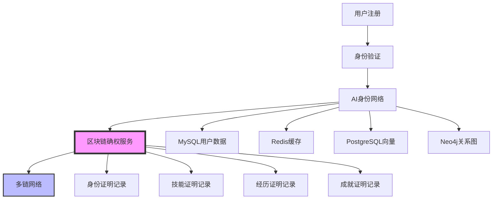

# AI身份网络与区块链集成分析
## 基于真实用户身份的确权溯源

## 概述

重新聚焦核心问题：**基于AI身份网络服务的真实用户身份确权溯源**，而不是DAO提案的确权。我们关注的是一个个基于Resume描述的活生生的用户，以及如何通过区块链确权他们的身份、技能、经历和成就。

## 🏗️ 现有AI身份网络架构分析

### ✅ 当前AI身份网络服务架构

#### 用户身份管理核心组件
1. **简历AI服务**: 简历解析、分析和优化
2. **身份验证服务**: 基于JWT的统一认证
3. **权限管理引擎**: 基于角色的细粒度权限控制
4. **数据隔离引擎**: 多层级数据隔离保护

#### 用户身份数据结构
```python
# 用户身份核心数据
class UserIdentity:
    user_id: str
    username: str
    email: str
    phone: str
    role: str
    status: str
    email_verified: bool
    phone_verified: bool
    first_name: str
    last_name: str
    
# 简历身份数据
class ResumeIdentity:
    user_id: str
    resume_content: str
    parsed_structure: dict
    skills: List[str]
    experience: List[dict]
    education: List[dict]
    achievements: List[dict]
    privacy_level: str
    anonymized_content: str
```

### 🎯 用户身份确权需求分析

#### 核心确权需求
1. **身份真实性**: 用户身份信息的真实性验证
2. **技能证明**: 用户技能和能力的可信证明
3. **经历验证**: 工作经历和教育背景的验证
4. **成就记录**: 职业成就和荣誉的不可篡改记录
5. **隐私保护**: 在确权的同时保护用户隐私

## 🚀 区块链介入时机设计

### 1. 用户身份生命周期确权点

#### 1.1 身份注册确权 (Identity Registration Proof)
```go
type IdentityRegistrationProof struct {
    UserID        string    `json:"user_id"`
    Username      string    `json:"username"`
    Email         string    `json:"email"`
    Phone         string    `json:"phone"`
    RegistrationTime time.Time `json:"registration_time"`
    VerificationHash string  `json:"verification_hash"`
    BlockchainTxHash string  `json:"blockchain_tx_hash"`
    ProofType     string    `json:"proof_type"` // "email_verified", "phone_verified", "identity_verified"
}
```

**介入时机**: 用户完成邮箱/手机验证时
**区块链作用**: 确权用户身份信息的真实性
**价值**: 建立可信的身份基础

#### 1.2 简历上传确权 (Resume Upload Proof)
```go
type ResumeUploadProof struct {
    UserID         string    `json:"user_id"`
    ResumeHash     string    `json:"resume_hash"`
    ContentHash    string    `json:"content_hash"`
    UploadTime     time.Time `json:"upload_time"`
    PrivacyLevel   string    `json:"privacy_level"`
    AnonymizedHash string    `json:"anonymized_hash"`
    BlockchainTxHash string  `json:"blockchain_tx_hash"`
    ProofType      string    `json:"proof_type"` // "resume_upload", "content_verified"
}
```

**介入时机**: 用户上传简历并通过AI解析时
**区块链作用**: 确权简历内容的真实性和完整性
**价值**: 建立可信的技能和经历基础

#### 1.3 技能验证确权 (Skill Verification Proof)
```go
type SkillVerificationProof struct {
    UserID         string    `json:"user_id"`
    SkillName      string    `json:"skill_name"`
    SkillLevel     string    `json:"skill_level"`
    VerificationMethod string `json:"verification_method"` // "ai_analysis", "certification", "peer_review"
    VerificationScore float64 `json:"verification_score"`
    VerificationTime time.Time `json:"verification_time"`
    BlockchainTxHash string  `json:"blockchain_tx_hash"`
    ProofType      string    `json:"proof_type"` // "skill_verified", "competency_proven"
}
```

**介入时机**: AI分析完成技能提取和评估时
**区块链作用**: 确权用户技能的真实性和水平
**价值**: 建立可信的技能证明体系

#### 1.4 经历验证确权 (Experience Verification Proof)
```go
type ExperienceVerificationProof struct {
    UserID         string    `json:"user_id"`
    CompanyName    string    `json:"company_name"`
    Position       string    `json:"position"`
    StartDate      time.Time `json:"start_date"`
    EndDate        time.Time `json:"end_date"`
    VerificationStatus string `json:"verification_status"` // "verified", "pending", "failed"
    VerificationMethod string `json:"verification_method"` // "ai_analysis", "third_party", "peer_review"
    BlockchainTxHash string  `json:"blockchain_tx_hash"`
    ProofType      string    `json:"proof_type"` // "experience_verified", "employment_proven"
}
```

**介入时机**: 工作经历验证完成时
**区块链作用**: 确权工作经历的真实性
**价值**: 建立可信的职业经历证明

#### 1.5 成就记录确权 (Achievement Record Proof)
```go
type AchievementRecordProof struct {
    UserID         string    `json:"user_id"`
    AchievementType string   `json:"achievement_type"` // "award", "certification", "project", "publication"
    AchievementName string   `json:"achievement_name"`
    AchievementDate time.Time `json:"achievement_date"`
    Issuer         string    `json:"issuer"`
    VerificationHash string  `json:"verification_hash"`
    BlockchainTxHash string  `json:"blockchain_tx_hash"`
    ProofType      string    `json:"proof_type"` // "achievement_recorded", "honor_proven"
}
```

**介入时机**: 用户获得成就或荣誉时
**区块链作用**: 确权成就的真实性和不可篡改性
**价值**: 建立可信的成就记录体系

### 2. 身份确权决策引擎

#### 2.1 确权决策规则
```go
type IdentityVerificationRule struct {
    RuleID         string
    Condition      func(context *IdentityContext) bool
    Action         func(context *IdentityContext) error
    Priority       int
    VerificationType VerificationType
    BlockchainRole BlockchainRole
}

type VerificationType string

const (
    VerificationTypeIdentity    VerificationType = "identity"
    VerificationTypeSkill       VerificationType = "skill"
    VerificationTypeExperience  VerificationType = "experience"
    VerificationTypeAchievement VerificationType = "achievement"
    VerificationTypePrivacy     VerificationType = "privacy"
)

type BlockchainRole string

const (
    RoleIdentityProof     BlockchainRole = "identity_proof"
    RoleSkillProof        BlockchainRole = "skill_proof"
    RoleExperienceProof   BlockchainRole = "experience_proof"
    RoleAchievementProof  BlockchainRole = "achievement_proof"
    RolePrivacyProtection BlockchainRole = "privacy_protection"
)
```

#### 2.2 具体确权规则
```go
// 身份注册确权规则
var IdentityRegistrationRule = IdentityVerificationRule{
    RuleID: "identity_registration",
    Condition: func(context *IdentityContext) bool {
        return context.ActionType == "identity_registration" && 
               context.UserStatus == "verified" &&
               context.EmailVerified == true &&
               context.PhoneVerified == true
    },
    Action: func(context *IdentityContext) error {
        return blockchainService.CreateIdentityProof(context.UserData)
    },
    Priority:       95,
    VerificationType: VerificationTypeIdentity,
    BlockchainRole: RoleIdentityProof,
}

// 技能验证确权规则
var SkillVerificationRule = IdentityVerificationRule{
    RuleID: "skill_verification",
    Condition: func(context *IdentityContext) bool {
        return context.ActionType == "skill_analysis" && 
               context.AIAnalysisScore > 0.8 &&
               context.SkillCount > 0
    },
    Action: func(context *IdentityContext) error {
        return blockchainService.CreateSkillProof(context.SkillData)
    },
    Priority:       90,
    VerificationType: VerificationTypeSkill,
    BlockchainRole: RoleSkillProof,
}

// 经历验证确权规则
var ExperienceVerificationRule = IdentityVerificationRule{
    RuleID: "experience_verification",
    Condition: func(context *IdentityContext) bool {
        return context.ActionType == "experience_analysis" && 
               context.ExperienceCount > 0 &&
               context.VerificationStatus == "verified"
    },
    Action: func(context *IdentityContext) error {
        return blockchainService.CreateExperienceProof(context.ExperienceData)
    },
    Priority:       85,
    VerificationType: VerificationTypeExperience,
    BlockchainRole: RoleExperienceProof,
}
```

### 3. 隐私保护确权机制

#### 3.1 隐私保护策略
```go
type PrivacyProtectionStrategy struct {
    StrategyName    string
    Description     string
    ProtectionLevel ProtectionLevel
    Implementation  PrivacyImplementation
    BlockchainRole  BlockchainRole
}

type ProtectionLevel string

const (
    ProtectionLevelPublic     ProtectionLevel = "public"
    ProtectionLevelPartial    ProtectionLevel = "partial"
    ProtectionLevelPrivate    ProtectionLevel = "private"
    ProtectionLevelConfidential ProtectionLevel = "confidential"
)

type PrivacyImplementation string

const (
    ImplementationAnonymization PrivacyImplementation = "anonymization"
    ImplementationEncryption    PrivacyImplementation = "encryption"
    ImplementationHashOnly      PrivacyImplementation = "hash_only"
    ImplementationZeroKnowledge PrivacyImplementation = "zero_knowledge"
)
```

#### 3.2 隐私保护确权规则
```go
// 隐私保护确权规则
var PrivacyProtectionRule = IdentityVerificationRule{
    RuleID: "privacy_protection",
    Condition: func(context *IdentityContext) bool {
        return context.PrivacyLevel == "partial" || 
               context.PrivacyLevel == "private" ||
               context.AnonymizedContent != ""
    },
    Action: func(context *IdentityContext) error {
        return blockchainService.CreatePrivacyProof(context.PrivacyData)
    },
    Priority:       100,
    VerificationType: VerificationTypePrivacy,
    BlockchainRole: RolePrivacyProtection,
}
```

## 🎯 区块链确权价值最大化

### 1. 身份确权价值分析

#### 1.1 透明度价值
- **身份透明**: 用户身份信息公开可查，建立信任
- **技能透明**: 用户技能水平公开可查，便于匹配
- **经历透明**: 工作经历公开可查，便于验证
- **成就透明**: 职业成就公开可查，便于评估

#### 1.2 信任价值
- **身份信任**: 基于区块链的身份证明，不可伪造
- **技能信任**: 基于AI分析的技能证明，客观可信
- **经历信任**: 基于验证的工作经历，真实可靠
- **成就信任**: 基于记录的成就证明，不可篡改

#### 1.3 合规价值
- **数据合规**: 符合数据保护法规要求
- **隐私合规**: 保护用户隐私权
- **审计合规**: 支持监管审计要求
- **跨境合规**: 支持跨境身份验证

### 2. 确权时机价值最大化

#### 2.1 实时确权 (高价值)
1. **身份注册**: 用户完成验证时立即上链确权
2. **技能分析**: AI完成技能分析时立即上链确权
3. **经历验证**: 经历验证完成时立即上链确权
4. **成就记录**: 获得成就时立即上链确权

#### 2.2 批量确权 (中等价值)
1. **简历更新**: 批量同步简历更新到区块链
2. **技能更新**: 批量同步技能更新到区块链
3. **经历更新**: 批量同步经历更新到区块链

#### 2.3 按需确权 (低价值)
1. **历史查询**: 按需查询历史确权记录
2. **统计分析**: 按需生成确权统计报告

### 3. 多链确权策略

#### 3.1 链选择策略
```go
type ChainSelectionStrategy struct {
    StrategyName    string
    Description     string
    ChainType       ChainType
    UseCase         string
    Cost            float64
    Security        SecurityLevel
    Privacy         PrivacyLevel
}

// 身份确权链选择
var IdentityProofChains = []ChainSelectionStrategy{
    {
        StrategyName: "华为云链身份确权",
        Description: "使用华为云链确权用户身份信息",
        ChainType: ChainTypeHuaweiCloud,
        UseCase: "身份验证",
        Cost: 0.01,
        Security: SecurityLevelHigh,
        Privacy: PrivacyLevelPartial,
    },
    {
        StrategyName: "以太坊技能确权",
        Description: "使用以太坊确权用户技能证明",
        ChainType: ChainTypeEthereum,
        UseCase: "技能验证",
        Cost: 0.05,
        Security: SecurityLevelHigh,
        Privacy: PrivacyLevelPublic,
    },
    {
        StrategyName: "FISCO BCOS经历确权",
        Description: "使用FISCO BCOS确权工作经历",
        ChainType: ChainTypeFiscoBcos,
        UseCase: "经历验证",
        Cost: 0.02,
        Security: SecurityLevelHigh,
        Privacy: PrivacyLevelPrivate,
    },
}
```

#### 3.2 跨链确权聚合
```go
type CrossChainIdentityProof struct {
    UserID         string                    `json:"user_id"`
    ProofType      string                    `json:"proof_type"`
    ChainProofs    map[ChainType]ChainProof  `json:"chain_proofs"`
    AggregatedHash string                    `json:"aggregated_hash"`
    VerificationScore float64                `json:"verification_score"`
    CreatedAt      time.Time                 `json:"created_at"`
}

type ChainProof struct {
    ChainType      ChainType `json:"chain_type"`
    TxHash         string    `json:"tx_hash"`
    BlockNumber    uint64    `json:"block_number"`
    ProofHash      string    `json:"proof_hash"`
    VerificationStatus string `json:"verification_status"`
}
```

## 🎯 实施策略

### 1. 分阶段实施

#### 第一阶段：身份基础确权 (2-3天)
1. **身份注册确权**: 实现用户身份注册的区块链确权
2. **基础验证**: 实现邮箱/手机验证的区块链记录
3. **隐私保护**: 实现隐私保护的区块链机制
4. **基础监控**: 实现确权状态监控

#### 第二阶段：技能经历确权 (3-4天)
1. **简历确权**: 实现简历上传和解析的区块链确权
2. **技能确权**: 实现AI技能分析的区块链确权
3. **经历确权**: 实现工作经历的区块链确权
4. **验证机制**: 实现第三方验证的区块链记录

#### 第三阶段：成就记录确权 (2-3天)
1. **成就确权**: 实现职业成就的区块链记录
2. **荣誉确权**: 实现荣誉和奖励的区块链记录
3. **证书确权**: 实现证书和认证的区块链记录
4. **跨链聚合**: 实现多链确权结果聚合

### 2. 数据流设计

#### 2.1 身份确权数据流


#### 2.2 确权验证流程
```go
type IdentityVerificationFlow struct {
    Step1IdentityRegistration   *IdentityRegistrationProof
    Step2ResumeUpload          *ResumeUploadProof
    Step3SkillVerification     *SkillVerificationProof
    Step4ExperienceVerification *ExperienceVerificationProof
    Step5AchievementRecord     *AchievementRecordProof
    FinalVerificationScore     float64
    BlockchainProofs          []ChainProof
}
```

## 🎉 预期效果

### 1. 身份确权价值
- **可信身份**: 基于区块链的可信身份证明
- **技能证明**: 基于AI分析的客观技能证明
- **经历验证**: 基于验证的真实经历记录
- **成就记录**: 基于区块链的不可篡改成就记录

### 2. 隐私保护价值
- **隐私保护**: 在确权的同时保护用户隐私
- **数据控制**: 用户对自己的数据有完全控制权
- **合规性**: 符合数据保护法规要求
- **透明度**: 透明的隐私保护机制

### 3. 系统价值
- **信任建立**: 基于区块链的信任机制
- **价值证明**: 用户技能和经历的价值证明
- **职业发展**: 支持用户职业发展路径
- **社会价值**: 建立可信的人才评价体系

## 总结

重新聚焦核心问题后，我们发现区块链的真正价值在于：

1. **真实用户身份确权**: 确权一个个活生生的用户的身份、技能、经历和成就
2. **AI分析结果确权**: 确权AI对用户简历分析的结果
3. **隐私保护确权**: 在确权的同时保护用户隐私
4. **跨链确权聚合**: 通过多链确权建立完整的用户身份证明体系

这个方案真正关注的是用户本身，而不是DAO治理，通过区块链确权用户的真实身份和价值！🎯
