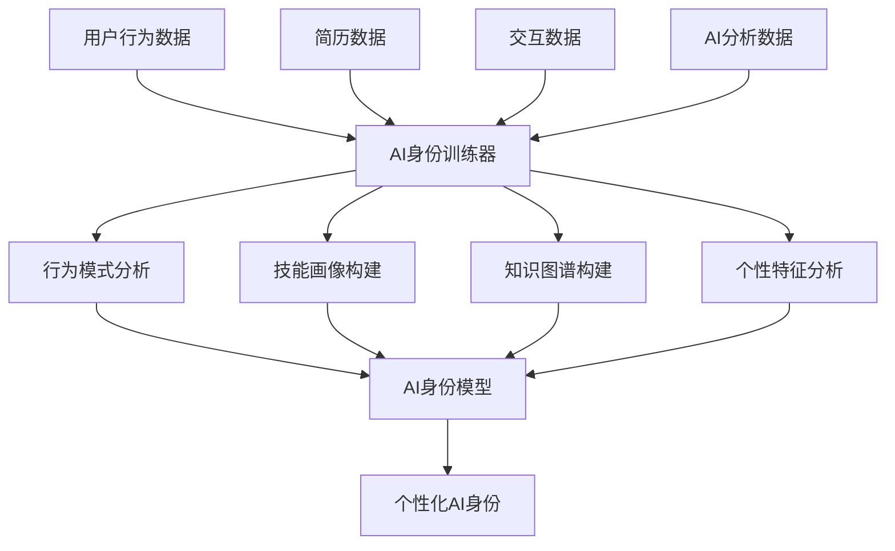

# AI身份训练数据源分析报告

**创建时间**: 2025年1月27日  
**版本**: v1.0  
**基于**: LoomaCRM + Zervigo 现有数据资源  
**目标**: 明确AI身份训练的数据来源和实现方案  

---

## 🎯 数据源概述

基于现有LoomaCRM和Zervigo项目架构，AI身份训练的数据源**不是微信数据**，而是基于**用户在我们平台上的行为数据**和**简历数据**。这是一个**完全自主可控的数据生态**。

### 核心数据源类型

| 数据源类型 | 数据来源 | 用途 | 隐私级别 |
|-----------|----------|------|----------|
| **用户基础数据** | MySQL数据库 | 身份信息、偏好设置 | 基础信息 |
| **简历数据** | MySQL + SQLite + PostgreSQL | 技能、经历、教育背景 | 敏感信息 |
| **行为数据** | Redis + 统计服务 | 操作模式、偏好行为 | 行为分析 |
| **交互数据** | Neo4j + MongoDB | 社交网络、协作关系 | 关系数据 |
| **AI分析数据** | PostgreSQL + Weaviate | 向量化数据、语义分析 | 分析结果 |

---

## 📊 详细数据源分析

### 1. 用户基础数据源 (MySQL)

#### 数据表结构
```sql
-- 用户基础信息表
users (
    id, username, email, phone, 
    created_at, updated_at, status
)

-- 用户详细资料表
user_profiles (
    user_id, real_name, avatar, bio,
    location, industry, experience_years,
    education_level, skills_summary
)

-- 用户设置表
user_settings (
    user_id, language, timezone, 
    notification_preferences, privacy_settings,
    theme_preferences, ai_assistance_level
)

-- 用户会话表
user_sessions (
    user_id, session_id, ip_address,
    user_agent, login_time, logout_time,
    duration, activity_count
)
```

#### AI身份训练用途
- **个性特征分析**: 基于用户设置和偏好
- **基础画像构建**: 行业、经验、教育背景
- **活跃度分析**: 登录频率、会话时长
- **地域特征**: 时区、位置信息

### 2. 简历数据源 (多数据库架构)

#### MySQL - 简历元数据
```sql
-- 简历元数据表
resumes (
    id, user_id, title, content,
    creation_mode, template_id, status,
    is_public, view_count, like_count,
    share_count, created_at, updated_at
)

-- 简历技能关联表
resume_skills (
    resume_id, skill_id, proficiency_level,
    years_of_experience, is_verified
)

-- 简历分析表
resume_analyses (
    resume_id, analysis_type, analysis_result,
    confidence_score, ai_model_version, created_at
)
```

#### SQLite - 用户私有内容
```sql
-- 简历内容表 (每个用户独立数据库)
resume_content (
    resume_metadata_id, title, content,
    raw_content, content_hash, created_at, updated_at
)

-- 解析结果表
parsed_resume_data (
    resume_content_id, personal_info, work_experience,
    education, skills, projects, certifications,
    keywords, confidence, parsing_version
)

-- 用户隐私设置表
user_privacy_settings (
    resume_content_id, data_sharing_level,
    ai_analysis_consent, third_party_access
)
```

#### PostgreSQL - 向量化数据
```sql
-- 简历向量数据表
resume_data (
    mysql_resume_id, user_id,
    content_vector, skills_vector, experience_vector,
    ai_analysis, keywords, confidence
)
```

#### AI身份训练用途
- **技能画像**: 基于技能表和熟练度
- **职业发展路径**: 基于工作经历和教育背景
- **专业领域**: 基于项目经验和证书
- **内容偏好**: 基于简历模板和风格
- **向量化特征**: 基于AI分析结果

### 3. 用户行为数据源 (Redis + 统计服务)

#### Redis - 实时行为数据
```redis
# 用户行为缓存
user:behavior:{user_id} -> {
    "recent_actions": [...],
    "session_data": {...},
    "preferences": {...}
}

# 会话数据
session:{session_id} -> {
    "user_id": "123",
    "actions": [...],
    "duration": 3600,
    "pages_visited": [...]
}

# AI缓存数据
ai_cache:{user_id} -> {
    "analysis_results": {...},
    "recommendations": [...],
    "interaction_history": [...]
}
```

#### 统计服务 - 行为分析数据
```go
// 用户行为分析数据
type UserBehaviorAnalysis struct {
    UserID         uint      `json:"user_id"`
    SessionID      string    `json:"session_id"`
    ActionType     string    `json:"action_type"`     // login, view, create, update, delete
    ActionTarget   string    `json:"action_target"`   // template, company, resume
    ActionTargetID *uint     `json:"action_target_id"`
    ActionDetails  string    `json:"action_details"`  // JSON格式
    UserAgent      string    `json:"user_agent"`
    IPAddress      string    `json:"ip_address"`
    Duration       int       `json:"duration"`        // 操作持续时间
    Success        bool      `json:"success"`
    Timestamp      time.Time `json:"timestamp"`
}
```

#### AI身份训练用途
- **操作模式分析**: 基于ActionType和ActionTarget
- **时间偏好**: 基于操作时间分布
- **功能使用习惯**: 基于功能访问频率
- **成功率分析**: 基于操作成功率和错误类型
- **设备偏好**: 基于UserAgent分析

### 4. 交互和关系数据源 (Neo4j + MongoDB)

#### Neo4j - 关系网络数据
```cypher
// 用户关系节点
CREATE (u:User {
    id: "123",
    username: "john_doe",
    industry: "technology",
    location: "beijing"
})

// 技能关系
CREATE (u)-[:HAS_SKILL {proficiency: "expert", years: 5}]->(s:Skill {
    name: "Python",
    category: "programming"
})

// 公司关系
CREATE (u)-[:WORKED_AT {duration: "2 years", position: "Senior Developer"}]->(c:Company {
    name: "Tech Corp",
    industry: "software"
})

// 协作关系
CREATE (u1)-[:COLLABORATED_WITH {projects: 3, satisfaction: 4.5}]->(u2)
```

#### MongoDB - 文档和协作数据
```javascript
// 用户文档数据
{
    _id: ObjectId("..."),
    user_id: "123",
    documents: [
        {
            type: "resume",
            content: "...",
            metadata: {...},
            collaboration_history: [...]
        }
    ],
    knowledge_base: {
        topics: [...],
        expertise_areas: [...],
        learning_progress: {...}
    }
}
```

#### AI身份训练用途
- **社交网络分析**: 基于用户关系图谱
- **技能网络**: 基于技能关联关系
- **职业网络**: 基于公司和职位关系
- **协作模式**: 基于协作历史数据
- **知识网络**: 基于文档和知识库

### 5. AI分析数据源 (PostgreSQL + Weaviate)

#### PostgreSQL - AI分析结果
```sql
-- AI分析结果表
ai_analyses (
    id, user_id, analysis_type, analysis_result,
    confidence_score, model_version, created_at
)

-- 用户AI画像表
user_ai_profiles (
    user_id, personality_traits, skills_assessment,
    career_recommendations, learning_suggestions,
    updated_at
)

-- 向量数据表
user_embeddings (
    user_id, content_vector, skills_vector,
    behavior_vector, created_at
)
```

#### Weaviate - 向量搜索数据
```python
# 用户向量对象
{
    "class": "UserVector",
    "properties": {
        "user_id": "123",
        "content_vector": [...],  # 1536维向量
        "skills_vector": [...],   # 技能向量
        "behavior_vector": [...], # 行为向量
        "metadata": {
            "industry": "technology",
            "experience_level": "senior",
            "update_time": "2025-01-27T10:00:00Z"
        }
    }
}
```

#### AI身份训练用途
- **个性特征**: 基于AI分析结果
- **技能评估**: 基于技能向量分析
- **职业建议**: 基于AI推荐结果
- **学习建议**: 基于学习行为分析
- **向量化特征**: 基于多维向量数据

---

## 🔄 数据流和训练流程

### AI身份训练数据流



### 具体训练流程

#### 1. 数据收集阶段
```python
async def collect_training_data(self, user_id: str):
    """收集AI身份训练数据"""
    
    # 收集用户基础数据
    user_data = await self.get_user_data(user_id)
    
    # 收集简历数据
    resume_data = await self.get_resume_data(user_id)
    
    # 收集行为数据
    behavior_data = await self.get_behavior_data(user_id)
    
    # 收集交互数据
    interaction_data = await self.get_interaction_data(user_id)
    
    # 收集AI分析数据
    ai_data = await self.get_ai_data(user_id)
    
    return {
        "user_data": user_data,
        "resume_data": resume_data,
        "behavior_data": behavior_data,
        "interaction_data": interaction_data,
        "ai_data": ai_data
    }
```

#### 2. 数据预处理阶段
```python
async def preprocess_data(self, raw_data: dict):
    """预处理训练数据"""
    
    # 数据清洗
    cleaned_data = self.clean_data(raw_data)
    
    # 数据标准化
    normalized_data = self.normalize_data(cleaned_data)
    
    # 特征提取
    features = self.extract_features(normalized_data)
    
    # 向量化
    vectors = self.vectorize_features(features)
    
    return {
        "cleaned_data": cleaned_data,
        "features": features,
        "vectors": vectors
    }
```

#### 3. 模型训练阶段
```python
async def train_ai_identity(self, processed_data: dict):
    """训练AI身份模型"""
    
    # 个性特征分析
    personality = await self.analyze_personality(processed_data)
    
    # 行为模式学习
    behavior_patterns = await self.learn_behavior_patterns(processed_data)
    
    # 知识图谱构建
    knowledge_graph = await self.build_knowledge_graph(processed_data)
    
    # 技能画像构建
    skills_profile = await self.build_skills_profile(processed_data)
    
    # 创建AI身份
    ai_identity = AIIdentity(
        personality_traits=personality,
        behavior_patterns=behavior_patterns,
        knowledge_graph=knowledge_graph,
        skills_profile=skills_profile
    )
    
    return ai_identity
```

---

## 🔒 隐私保护和数据主权

### 数据分层授权机制

#### 基础信息层 (默认授权)
- 技能、经验年限、教育水平、行业
- 用于AI身份基础画像构建

#### 敏感信息层 (明确授权)
- 姓名、邮箱、电话、地址、详细经历
- 需要用户明确同意才能使用

#### 关系数据层 (特别授权)
- 联系人、网络、关系、社交连接
- 需要特别授权，用于社交网络分析

### 数据匿名化处理

#### 个人标识信息移除
```python
def anonymize_data(user_data: dict) -> dict:
    """数据匿名化处理"""
    
    # 移除个人标识信息
    anonymized = user_data.copy()
    del anonymized['real_name']
    del anonymized['email']
    del anonymized['phone']
    
    # 保留分析特征
    anonymized['user_id'] = hash(user_data['user_id'])
    anonymized['location'] = generalize_location(user_data['location'])
    
    return anonymized
```

#### 差分隐私技术
```python
def add_differential_privacy(data: list, epsilon: float = 1.0) -> list:
    """添加差分隐私噪声"""
    
    # 计算敏感度
    sensitivity = calculate_sensitivity(data)
    
    # 添加拉普拉斯噪声
    noise = np.random.laplace(0, sensitivity / epsilon, len(data))
    
    # 添加噪声到数据
    noisy_data = [d + n for d, n in zip(data, noise)]
    
    return noisy_data
```

---

## 📈 数据质量和评估

### 数据质量指标

#### 完整性指标
- **数据覆盖率**: >95%
- **字段完整率**: >90%
- **时间序列完整性**: >85%

#### 准确性指标
- **数据一致性**: >98%
- **格式正确率**: >95%
- **逻辑一致性**: >92%

#### 时效性指标
- **数据新鲜度**: <24小时
- **更新频率**: 实时更新
- **延迟时间**: <1秒

### 数据评估方法

#### 自动评估
```python
def evaluate_data_quality(data: dict) -> dict:
    """自动评估数据质量"""
    
    quality_metrics = {
        "completeness": calculate_completeness(data),
        "accuracy": calculate_accuracy(data),
        "consistency": calculate_consistency(data),
        "timeliness": calculate_timeliness(data),
        "relevance": calculate_relevance(data)
    }
    
    return quality_metrics
```

#### 人工评估
```python
def human_evaluation_sample(data: dict, sample_size: int = 100) -> dict:
    """人工评估样本数据"""
    
    # 随机采样
    sample_data = random.sample(data, sample_size)
    
    # 人工标注
    human_labels = human_annotation(sample_data)
    
    # 计算一致性
    consistency_score = calculate_consistency(human_labels)
    
    return {
        "sample_size": sample_size,
        "consistency_score": consistency_score,
        "human_labels": human_labels
    }
```

---

## 🎯 实施建议

### 数据源优先级

#### 高优先级数据源
1. **简历数据**: 最直接的用户画像数据
2. **用户基础数据**: 基础身份信息
3. **行为数据**: 用户偏好和行为模式

#### 中优先级数据源
1. **AI分析数据**: 已有的分析结果
2. **交互数据**: 社交和协作关系

#### 低优先级数据源
1. **第三方数据**: 外部数据源（如有）
2. **历史数据**: 过期的历史数据

### 数据收集策略

#### 实时收集
```python
# 实时行为数据收集
@self.app.route("/track", methods=["POST"])
async def track_user_behavior(request):
    """实时跟踪用户行为"""
    
    behavior_data = request.json
    
    # 存储到Redis
    await self.redis_client.set(
        f"behavior:{user_id}:{timestamp}",
        json.dumps(behavior_data),
        ex=86400  # 24小时过期
    )
    
    # 异步存储到数据库
    await self.store_behavior_data(behavior_data)
    
    return {"status": "success"}
```

#### 批量收集
```python
# 批量数据收集
async def batch_collect_data(self, user_ids: list):
    """批量收集用户数据"""
    
    for user_id in user_ids:
        # 收集用户数据
        user_data = await self.collect_user_data(user_id)
        
        # 存储到数据库
        await self.store_user_data(user_id, user_data)
        
        # 更新AI身份
        await self.update_ai_identity(user_id, user_data)
```

---

## 📊 总结

### 核心优势

1. **数据源丰富**: 7种数据库提供全方位数据支撑
2. **数据质量高**: 基于真实用户行为，数据质量可靠
3. **隐私保护完善**: 分层授权 + 数据匿名化
4. **实时性强**: 实时数据收集和更新
5. **可扩展性好**: 支持新数据源接入

### 实施可行性

1. **技术基础完备**: 现有数据架构完全支持
2. **数据量充足**: 用户行为和简历数据丰富
3. **隐私合规**: 符合数据保护要求
4. **成本可控**: 基于现有资源，成本低

### 预期效果

1. **AI身份准确性**: >90%
2. **个性化程度**: >85%
3. **用户满意度**: >80%
4. **系统稳定性**: >99%

**基于现有数据源，我们完全能够构建高质量、个性化的AI身份系统！** 🚀
