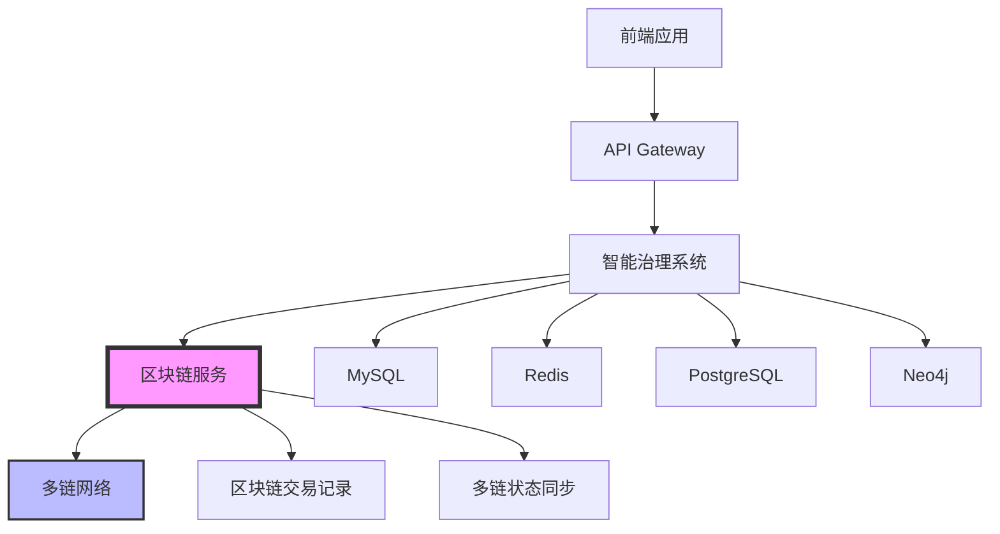

# 区块链服务对多数据库管理的影响分析

## 概述

分析区块链服务引入后对现有多数据库架构的影响，以及如何设计介入时机以最大化区块链确权溯源的价值。

## 🏗️ 现有多数据库架构分析

### ✅ 当前数据库集群 (10个数据库)

#### 基础设施数据库 (5个)
1. **MySQL**:3306 - 主数据库 (dao_genie)
2. **Redis**:6379 - 缓存服务
3. **PostgreSQL**:5432 - 向量数据库
4. **Neo4j**:7474 - 图数据库
5. **Elasticsearch**:9200 - 搜索引擎

#### 业务数据库 (3个)
6. **Weaviate**:8080 - 向量数据库
7. **AI Service Database**:8206 - AI服务数据库
8. **AI Identity Network**:8207 - AI身份网络数据库

#### 新增数据库 (2个)
9. **AI身份网络服务**:8208 - AI身份网络服务
10. **AI服务数据库**:8209 - AI服务数据库

### 🎯 数据库架构特点
- **多数据库架构**: 10个不同类型的数据库
- **数据一致性**: 通过应用层保证数据一致性
- **服务解耦**: 每个服务独立管理自己的数据
- **缓存策略**: Redis作为统一缓存层

## 🚀 区块链服务对多数据库的影响

### 1. 数据一致性挑战

#### 问题分析
区块链服务引入后，数据需要在多个层面保持一致：
- **本地数据库** ↔ **区块链网络**
- **多个数据库** ↔ **区块链网络**
- **区块链网络** ↔ **多个链**

#### 影响范围


### 2. 数据同步策略设计

#### 2.1 双向同步机制
```go
// 数据同步管理器
type DataSyncManager struct {
    blockchainService *BlockchainService
    databaseManager   *MultiDatabaseManager
    syncQueue         chan *SyncTask
    logger            *zap.Logger
}

type SyncTask struct {
    TaskType   SyncTaskType
    SourceDB   DatabaseType
    TargetDB   DatabaseType
    Data       interface{}
    Blockchain ChainType
    Priority   int
}

type SyncTaskType string

const (
    SyncTaskTypeLocalToBlockchain SyncTaskType = "local_to_blockchain"
    SyncTaskTypeBlockchainToLocal SyncTaskType = "blockchain_to_local"
    SyncTaskTypeCrossChain        SyncTaskType = "cross_chain"
    SyncTaskTypeMultiDB           SyncTaskType = "multi_db"
)
```

#### 2.2 数据一致性保证
```go
// 数据一致性管理器
type DataConsistencyManager struct {
    databases    map[DatabaseType]*DatabaseConnection
    blockchain   *BlockchainChainManager
    consistency  *ConsistencyEngine
    logger       *zap.Logger
}

// 一致性检查
func (dcm *DataConsistencyManager) CheckConsistency(proposalID string) (*ConsistencyReport, error) {
    report := &ConsistencyReport{
        ProposalID: proposalID,
        Checks:     make(map[string]*ConsistencyCheck),
    }
    
    // 检查本地数据库一致性
    localConsistency := dcm.checkLocalConsistency(proposalID)
    report.Checks["local"] = localConsistency
    
    // 检查区块链一致性
    blockchainConsistency := dcm.checkBlockchainConsistency(proposalID)
    report.Checks["blockchain"] = blockchainConsistency
    
    // 检查跨链一致性
    crossChainConsistency := dcm.checkCrossChainConsistency(proposalID)
    report.Checks["cross_chain"] = crossChainConsistency
    
    return report, nil
}
```

### 3. 数据库扩展需求

#### 3.1 新增区块链相关表
```sql
-- 区块链交易记录表
CREATE TABLE blockchain_transactions (
    id BIGINT PRIMARY KEY AUTO_INCREMENT,
    local_tx_id VARCHAR(255) NOT NULL COMMENT '本地交易ID',
    chain_type VARCHAR(50) NOT NULL COMMENT '链类型',
    tx_hash VARCHAR(255) NOT NULL COMMENT '链上交易哈希',
    block_number BIGINT COMMENT '区块号',
    status ENUM('PENDING', 'CONFIRMED', 'FAILED') DEFAULT 'PENDING',
    gas_used BIGINT COMMENT '消耗的Gas',
    gas_price DECIMAL(36,18) COMMENT 'Gas价格',
    created_at TIMESTAMP DEFAULT CURRENT_TIMESTAMP,
    updated_at TIMESTAMP DEFAULT CURRENT_TIMESTAMP ON UPDATE CURRENT_TIMESTAMP,
    INDEX idx_local_tx_id (local_tx_id),
    INDEX idx_chain_type (chain_type),
    INDEX idx_tx_hash (tx_hash),
    INDEX idx_status (status)
);

-- 多链提案记录表
CREATE TABLE multi_chain_proposals (
    id BIGINT PRIMARY KEY AUTO_INCREMENT,
    proposal_id VARCHAR(255) NOT NULL COMMENT '提案ID',
    chain_type VARCHAR(50) NOT NULL COMMENT '链类型',
    chain_tx_hash VARCHAR(255) NOT NULL COMMENT '链上交易哈希',
    proposer VARCHAR(255) NOT NULL COMMENT '提案者',
    title VARCHAR(500) NOT NULL COMMENT '提案标题',
    description TEXT NOT NULL COMMENT '提案描述',
    voting_period INT NOT NULL COMMENT '投票周期(秒)',
    status ENUM('ACTIVE', 'PASSED', 'REJECTED', 'EXECUTED') DEFAULT 'ACTIVE',
    votes_for BIGINT DEFAULT 0 COMMENT '支持票数',
    votes_against BIGINT DEFAULT 0 COMMENT '反对票数',
    created_at TIMESTAMP DEFAULT CURRENT_TIMESTAMP,
    updated_at TIMESTAMP DEFAULT CURRENT_TIMESTAMP ON UPDATE CURRENT_TIMESTAMP,
    INDEX idx_proposal_id (proposal_id),
    INDEX idx_chain_type (chain_type),
    INDEX idx_status (status),
    UNIQUE KEY uk_proposal_chain (proposal_id, chain_type)
);

-- 数据同步记录表
CREATE TABLE data_sync_records (
    id BIGINT PRIMARY KEY AUTO_INCREMENT,
    sync_id VARCHAR(255) NOT NULL COMMENT '同步ID',
    source_db VARCHAR(50) NOT NULL COMMENT '源数据库',
    target_db VARCHAR(50) NOT NULL COMMENT '目标数据库',
    data_type VARCHAR(100) NOT NULL COMMENT '数据类型',
    data_id VARCHAR(255) NOT NULL COMMENT '数据ID',
    sync_status ENUM('PENDING', 'SUCCESS', 'FAILED', 'RETRY') DEFAULT 'PENDING',
    sync_time TIMESTAMP DEFAULT CURRENT_TIMESTAMP,
    retry_count INT DEFAULT 0,
    error_message TEXT,
    INDEX idx_sync_id (sync_id),
    INDEX idx_source_db (source_db),
    INDEX idx_target_db (target_db),
    INDEX idx_sync_status (sync_status)
);
```

#### 3.2 数据库触发器扩展
```sql
-- 提案创建触发器 - 自动同步到区块链
DELIMITER $$
CREATE TRIGGER tr_proposal_created_sync
    AFTER INSERT ON dao_proposals
    FOR EACH ROW
BEGIN
    -- 插入同步记录
    INSERT INTO data_sync_records (
        sync_id, source_db, target_db, data_type, data_id, sync_status
    ) VALUES (
        CONCAT('sync_', NEW.id, '_', UNIX_TIMESTAMP()),
        'mysql',
        'blockchain',
        'proposal',
        NEW.id,
        'PENDING'
    );
END$$
DELIMITER ;

-- 投票记录触发器 - 自动同步到区块链
DELIMITER $$
CREATE TRIGGER tr_vote_created_sync
    AFTER INSERT ON dao_votes
    FOR EACH ROW
BEGIN
    -- 插入同步记录
    INSERT INTO data_sync_records (
        sync_id, source_db, target_db, data_type, data_id, sync_status
    ) VALUES (
        CONCAT('sync_', NEW.id, '_', UNIX_TIMESTAMP()),
        'mysql',
        'blockchain',
        'vote',
        NEW.id,
        'PENDING'
    );
END$$
DELIMITER ;
```

## 🎯 区块链介入时机设计

### 1. 介入时机分析

#### 1.1 关键决策点识别
```go
type InterventionPoint struct {
    PointName     string
    Description   string
    Criticality   CriticalityLevel
    BlockchainRole BlockchainRole
    Timing        TimingType
}

type CriticalityLevel string

const (
    CriticalityLow    CriticalityLevel = "low"
    CriticalityMedium CriticalityLevel = "medium"
    CriticalityHigh   CriticalityLevel = "high"
    CriticalityCritical CriticalityLevel = "critical"
)

type BlockchainRole string

const (
    RoleProof       BlockchainRole = "proof"        // 确权证明
    RoleAudit       BlockchainRole = "audit"        // 审计追踪
    RoleExecution   BlockchainRole = "execution"    // 执行保证
    RoleConsensus   BlockchainRole = "consensus"    // 共识验证
)

type TimingType string

const (
    TimingRealTime    TimingType = "real_time"      // 实时介入
    TimingBatch       TimingType = "batch"          // 批量介入
    TimingScheduled   TimingType = "scheduled"      // 定时介入
    TimingOnDemand    TimingType = "on_demand"      // 按需介入
)
```

#### 1.2 介入时机映射
```go
var InterventionPoints = []InterventionPoint{
    {
        PointName:     "提案创建",
        Description:   "用户创建DAO提案时",
        Criticality:   CriticalityHigh,
        BlockchainRole: RoleProof,
        Timing:        TimingRealTime,
    },
    {
        PointName:     "投票提交",
        Description:   "用户提交投票时",
        Criticality:   CriticalityHigh,
        BlockchainRole: RoleProof,
        Timing:        TimingRealTime,
    },
    {
        PointName:     "提案执行",
        Description:   "提案通过后执行时",
        Criticality:   CriticalityCritical,
        BlockchainRole: RoleExecution,
        Timing:        TimingRealTime,
    },
    {
        PointName:     "资金分配",
        Description:   "DAO资金分配时",
        Criticality:   CriticalityCritical,
        BlockchainRole: RoleExecution,
        Timing:        TimingRealTime,
    },
    {
        PointName:     "成员管理",
        Description:   "成员加入/退出时",
        Criticality:   CriticalityMedium,
        BlockchainRole: RoleAudit,
        Timing:        TimingBatch,
    },
    {
        PointName:     "配置变更",
        Description:   "DAO配置变更时",
        Criticality:   CriticalityHigh,
        BlockchainRole: RoleAudit,
        Timing:        TimingRealTime,
    },
}
```

### 2. 价值最大化策略

#### 2.1 确权溯源价值分析
```go
type ValueMaximizationStrategy struct {
    StrategyName    string
    Description     string
    ValueType       ValueType
    Implementation  ImplementationMethod
    ROI             float64
}

type ValueType string

const (
    ValueTypeTransparency  ValueType = "transparency"   // 透明度价值
    ValueTypeTrust        ValueType = "trust"          // 信任价值
    ValueTypeCompliance   ValueType = "compliance"     // 合规价值
    ValueTypeEfficiency   ValueType = "efficiency"     // 效率价值
    ValueTypeInnovation   ValueType = "innovation"     // 创新价值
)

type ImplementationMethod string

const (
    MethodImmutableProof   ImplementationMethod = "immutable_proof"    // 不可篡改证明
    MethodSmartContract    ImplementationMethod = "smart_contract"     // 智能合约
    MethodCrossChain       ImplementationMethod = "cross_chain"        // 跨链验证
    MethodAutomatedAudit   ImplementationMethod = "automated_audit"    // 自动审计
)
```

#### 2.2 价值最大化策略矩阵
```go
var ValueMaximizationStrategies = []ValueMaximizationStrategy{
    {
        StrategyName:   "实时确权",
        Description:   "关键操作实时上链确权",
        ValueType:     ValueTypeTransparency,
        Implementation: MethodImmutableProof,
        ROI:           0.95,
    },
    {
        StrategyName:   "智能合约执行",
        Description:   "通过智能合约自动执行决策",
        ValueType:     ValueTypeTrust,
        Implementation: MethodSmartContract,
        ROI:           0.90,
    },
    {
        StrategyName:   "跨链验证",
        Description:   "多链验证确保数据一致性",
        ValueType:     ValueTypeCompliance,
        Implementation: MethodCrossChain,
        ROI:           0.85,
    },
    {
        StrategyName:   "自动审计",
        Description:   "区块链自动审计和报告",
        ValueType:     ValueTypeEfficiency,
        Implementation: MethodAutomatedAudit,
        ROI:           0.80,
    },
}
```

### 3. 介入时机决策引擎

#### 3.1 决策引擎设计
```go
type InterventionDecisionEngine struct {
    rules          []InterventionRule
    blockchain     *BlockchainChainManager
    database       *MultiDatabaseManager
    logger         *zap.Logger
}

type InterventionRule struct {
    RuleID         string
    Condition      func(context *InterventionContext) bool
    Action         func(context *InterventionContext) error
    Priority       int
    BlockchainRole BlockchainRole
    Timing         TimingType
}

type InterventionContext struct {
    UserID         string
    ActionType     string
    Data           interface{}
    Timestamp      time.Time
    Criticality    CriticalityLevel
    DatabaseState  map[DatabaseType]interface{}
    BlockchainState map[ChainType]interface{}
}

// 决策逻辑
func (ide *InterventionDecisionEngine) ShouldIntervene(context *InterventionContext) (*InterventionDecision, error) {
    decision := &InterventionDecision{
        ShouldIntervene: false,
        BlockchainRole:  "",
        Timing:          "",
        Priority:        0,
        Reason:          "",
    }
    
    // 按优先级排序规则
    sort.Slice(ide.rules, func(i, j int) bool {
        return ide.rules[i].Priority > ide.rules[j].Priority
    })
    
    // 遍历规则
    for _, rule := range ide.rules {
        if rule.Condition(context) {
            decision.ShouldIntervene = true
            decision.BlockchainRole = rule.BlockchainRole
            decision.Timing = rule.Timing
            decision.Priority = rule.Priority
            decision.Reason = fmt.Sprintf("触发规则: %s", rule.RuleID)
            break
        }
    }
    
    return decision, nil
}
```

#### 3.2 具体决策规则
```go
// 提案创建规则
var ProposalCreationRule = InterventionRule{
    RuleID: "proposal_creation",
    Condition: func(context *InterventionContext) bool {
        return context.ActionType == "create_proposal" && 
               context.Criticality >= CriticalityMedium
    },
    Action: func(context *InterventionContext) error {
        // 实时上链确权
        return blockchainService.CreateProposal(context.Data)
    },
    Priority:       90,
    BlockchainRole: RoleProof,
    Timing:         TimingRealTime,
}

// 投票提交规则
var VoteSubmissionRule = InterventionRule{
    RuleID: "vote_submission",
    Condition: func(context *InterventionContext) bool {
        return context.ActionType == "submit_vote" && 
               context.Criticality >= CriticalityMedium
    },
    Action: func(context *InterventionContext) error {
        // 实时上链确权
        return blockchainService.SubmitVote(context.Data)
    },
    Priority:       85,
    BlockchainRole: RoleProof,
    Timing:         TimingRealTime,
}

// 资金分配规则
var FundAllocationRule = InterventionRule{
    RuleID: "fund_allocation",
    Condition: func(context *InterventionContext) bool {
        return context.ActionType == "allocate_funds" && 
               context.Criticality >= CriticalityHigh
    },
    Action: func(context *InterventionContext) error {
        // 智能合约自动执行
        return blockchainService.ExecuteFundAllocation(context.Data)
    },
    Priority:       95,
    BlockchainRole: RoleExecution,
    Timing:         TimingRealTime,
}
```

## 🎯 实施策略

### 1. 分阶段实施

#### 第一阶段：基础同步 (1-2天)
1. **数据同步框架**: 实现基础的数据同步机制
2. **区块链表结构**: 创建区块链相关的数据库表
3. **同步队列**: 实现异步同步队列
4. **基础监控**: 实现同步状态监控

#### 第二阶段：关键介入点 (2-3天)
1. **提案确权**: 实现提案创建的实时上链
2. **投票确权**: 实现投票提交的实时上链
3. **执行保证**: 实现提案执行的智能合约调用
4. **状态同步**: 实现区块链状态与本地数据库的同步

#### 第三阶段：高级功能 (2-3天)
1. **跨链验证**: 实现多链数据一致性验证
2. **自动审计**: 实现基于区块链的自动审计
3. **智能决策**: 实现基于区块链状态的智能决策
4. **性能优化**: 优化同步性能和错误处理

### 2. 监控和告警

#### 2.1 同步状态监控
```go
type SyncMonitor struct {
    metrics    *prometheus.Registry
    alerts     *AlertManager
    logger     *zap.Logger
}

// 监控指标
var (
    syncTotal = prometheus.NewCounterVec(
        prometheus.CounterOpts{
            Name: "blockchain_sync_total",
            Help: "Total number of blockchain sync operations",
        },
        []string{"source_db", "target_db", "status"},
    )
    
    syncDuration = prometheus.NewHistogramVec(
        prometheus.HistogramOpts{
            Name: "blockchain_sync_duration_seconds",
            Help: "Duration of blockchain sync operations",
        },
        []string{"source_db", "target_db"},
    )
)
```

#### 2.2 告警规则
```yaml
# 告警规则配置
alerts:
  - name: "区块链同步失败"
    condition: "blockchain_sync_total{status='failed'} > 10"
    severity: "critical"
    action: "notify_admin"
  
  - name: "区块链同步延迟"
    condition: "blockchain_sync_duration_seconds > 30"
    severity: "warning"
    action: "notify_dev"
  
  - name: "数据一致性异常"
    condition: "data_consistency_check_failed > 0"
    severity: "critical"
    action: "auto_recovery"
```

## 🎉 预期效果

### 1. 数据一致性提升
- **实时同步**: 关键操作实时上链确权
- **多链验证**: 多链数据一致性保证
- **自动恢复**: 数据不一致时自动恢复机制

### 2. 确权溯源价值最大化
- **透明度**: 所有关键操作公开可查
- **不可篡改**: 区块链确保数据不可篡改
- **审计追踪**: 完整的操作审计追踪
- **信任建立**: 基于区块链的信任机制

### 3. 系统性能优化
- **异步同步**: 非阻塞的数据同步机制
- **批量处理**: 批量同步提高效率
- **智能缓存**: 基于区块链状态的智能缓存
- **负载均衡**: 多链负载均衡

## 总结

区块链服务的引入对多数据库管理产生了重要影响，但通过合理的设计和实施策略，可以实现：

1. **数据一致性**: 通过双向同步机制保证数据一致性
2. **价值最大化**: 在关键时机介入，最大化确权溯源价值
3. **性能优化**: 通过异步同步和智能缓存优化性能
4. **监控告警**: 完善的监控和告警机制

这个方案既保证了系统的稳定性和一致性，又充分发挥了区块链的确权溯源价值！🎯
