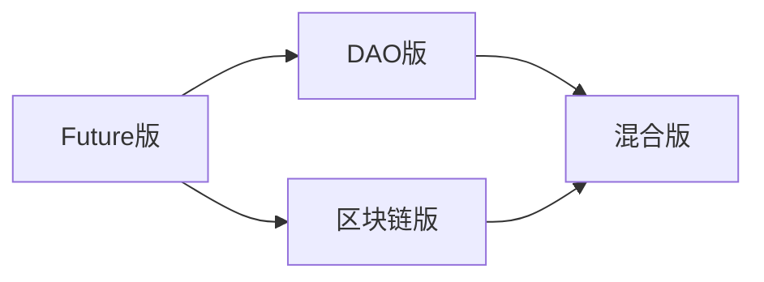

# 三版本数据库表结构对比分析

**文档版本**: v1.0  
**创建时间**: 2025-10-05  
**对比版本**: Future版、DAO版、区块链版  

## 📋 对比概述

本文档详细对比分析了三个版本的数据库表结构设计，展示各版本的特色功能、共同基础架构以及差异化设计。

## 🎯 各版本业务定位

| 版本 | 业务定位 | 核心功能 | 目标用户 |
|------|----------|----------|----------|
| **Future版** | 传统简历管理平台 | 简历管理、求职匹配、企业招聘 | 求职者、企业HR |
| **DAO版** | 去中心化自治组织平台 | 治理投票、代币经济、社区管理 | DAO成员、治理参与者 |
| **区块链版** | 加密货币交易平台 | 数字钱包、交易管理、DeFi集成 | 交易者、投资者 |

## 📊 表结构数量对比

| 版本 | 总表数 | 用户管理 | 核心业务 | 系统管理 | 特色功能 |
|------|--------|----------|----------|----------|----------|
| **Future版** | 20个 | 2个 | 16个 | 2个 | 简历管理、积分系统 |
| **DAO版** | 18个 | 2个 | 13个 | 3个 | 治理系统、代币经济 |
| **区块链版** | 20个 | 2个 | 14个 | 4个 | 钱包管理、DeFi集成 |

## 🔄 共同基础架构

### 1. 用户管理模块（三版本通用）

| 表名 | Future版 | DAO版 | 区块链版 | 说明 |
|------|----------|-------|----------|------|
| **用户表** | users | dao_users | blockchain_users | 基础用户信息 |
| **用户资料表** | user_profiles | dao_user_profiles | blockchain_user_profiles | 详细用户资料 |

#### 共同字段对比
| 字段名 | Future版 | DAO版 | 区块链版 | 说明 |
|--------|----------|-------|----------|------|
| id | ✅ | ✅ | ✅ | 主键 |
| uuid | ✅ | ✅ | ✅ | 唯一标识 |
| username | ✅ | ✅ | ✅ | 用户名 |
| email | ✅ | ✅ | ✅ | 邮箱 |
| password_hash | ✅ | ✅ | ✅ | 密码哈希 |
| status | ✅ | ✅ | ✅ | 状态 |
| role | ✅ | ✅ | ✅ | 角色 |
| email_verified | ✅ | ✅ | ✅ | 邮箱验证 |
| phone_verified | ✅ | ✅ | ✅ | 电话验证 |
| created_at | ✅ | ✅ | ✅ | 创建时间 |
| updated_at | ✅ | ✅ | ✅ | 更新时间 |

#### 版本特有字段
| 版本 | 特有字段 | 说明 |
|------|----------|------|
| **DAO版** | kyc_status, kyc_level | KYC验证状态和等级 |
| **区块链版** | kyc_status, kyc_level | KYC验证状态和等级 |

### 2. 系统管理模块（三版本通用）

| 表名 | Future版 | DAO版 | 区块链版 | 说明 |
|------|----------|-------|----------|------|
| **会话表** | user_sessions | dao_sessions | blockchain_sessions | 用户会话管理 |
| **通知表** | notifications | dao_notifications | blockchain_notifications | 系统通知 |
| **审计日志表** | audit_logs | dao_audit_logs | blockchain_audit_logs | 操作审计 |

## 🎨 版本特色功能对比

### Future版特色功能

#### 简历管理核心表
| 表名 | 用途 | 字段特点 |
|------|------|----------|
| resume_metadata | 简历元数据 | MySQL存储，包含用户ID、标题、状态等 |
| resume_content | 简历内容 | SQLite存储，用户专属内容 |
| resume_files | 简历文件 | 文件元数据管理 |
| resume_templates | 简历模板 | 模板管理 |
| resume_analyses | 简历分析 | AI分析结果 |

#### 标准化数据表
| 表名 | 用途 | 字段特点 |
|------|------|----------|
| skills | 标准化技能 | 技能库管理 |
| companies | 标准化公司 | 公司信息库 |
| positions | 标准化职位 | 职位信息库 |

#### 积分系统表
| 表名 | 用途 | 字段特点 |
|------|------|----------|
| points | 积分系统 | 用户积分管理 |
| point_history | 积分历史 | 积分变动记录 |

### DAO版特色功能

#### DAO治理系统表
| 表名 | 用途 | 字段特点 |
|------|------|----------|
| dao_organizations | DAO组织 | 组织基本信息、治理模式 |
| dao_memberships | 成员关系 | 用户与DAO的关系 |
| dao_proposals | 治理提案 | 提案内容、投票参数 |
| dao_votes | 投票记录 | 投票历史、权重计算 |

#### 代币经济系统表
| 表名 | 用途 | 字段特点 |
|------|------|----------|
| dao_tokens | DAO代币 | 代币信息、合约地址 |
| dao_wallets | DAO钱包 | 钱包管理、网络支持 |
| dao_token_balances | 代币余额 | 余额管理、锁定状态 |

#### DAO积分系统表
| 表名 | 用途 | 字段特点 |
|------|------|----------|
| dao_points | DAO积分 | 积分管理、锁定机制 |
| dao_point_history | DAO积分历史 | 积分变动记录 |
| dao_rewards | DAO奖励 | 奖励机制、条件设置 |

### 区块链版特色功能

#### 钱包管理系统表
| 表名 | 用途 | 字段特点 |
|------|------|----------|
| blockchain_wallets | 数字钱包 | 钱包地址、类型、网络 |
| blockchain_wallet_balances | 钱包余额 | 多代币余额管理 |
| blockchain_tokens | 代币信息 | 代币元数据、价格信息 |

#### 交易管理系统表
| 表名 | 用途 | 字段特点 |
|------|------|----------|
| blockchain_transactions | 交易记录 | 交易哈希、状态、Gas费用 |
| blockchain_transaction_status_history | 交易状态历史 | 状态变更记录 |
| blockchain_trading_pairs | 交易对 | 交易对信息、价格数据 |

#### 智能合约系统表
| 表名 | 用途 | 字段特点 |
|------|------|----------|
| blockchain_smart_contracts | 智能合约 | 合约地址、ABI、源代码 |
| blockchain_contract_calls | 合约调用 | 调用记录、参数、返回值 |
| blockchain_defi_protocols | DeFi协议 | 协议信息、TVL、APY |

#### DeFi集成系统表
| 表名 | 用途 | 字段特点 |
|------|------|----------|
| blockchain_liquidity_mining | 流动性挖矿 | LP代币、奖励计算 |
| blockchain_staking_records | 质押记录 | 质押数量、解锁时间 |

#### 区块链同步系统表
| 表名 | 用途 | 字段特点 |
|------|------|----------|
| blockchain_sync_status | 同步状态 | 区块同步、网络状态 |

## 📈 数据模型复杂度对比

### 表关系复杂度
| 版本 | 主要实体 | 关系复杂度 | 特色 |
|------|----------|------------|------|
| **Future版** | 用户、简历、技能、公司 | 中等 | 简历为中心的关系网 |
| **DAO版** | 用户、组织、提案、投票 | 高 | 治理为中心的关系网 |
| **区块链版** | 用户、钱包、交易、合约 | 很高 | 交易为中心的关系网 |

### 数据类型复杂度
| 版本 | JSON字段 | 数值精度 | 加密字段 | 特色 |
|------|----------|----------|----------|------|
| **Future版** | 3个 | 标准 | 无 | 结构化数据为主 |
| **DAO版** | 4个 | 标准 | 无 | 治理参数复杂 |
| **区块链版** | 5个 | 高精度 | 有 | 区块链数据复杂 |

## 🔗 外键关系对比

### 核心外键关系（三版本通用）
```sql
-- 用户资料表
user_profiles.user_id → users.id
dao_user_profiles.user_id → dao_users.id
blockchain_user_profiles.user_id → blockchain_users.id

-- 会话表
user_sessions.user_id → users.id
dao_sessions.user_id → dao_users.id
blockchain_sessions.user_id → blockchain_users.id

-- 通知表
notifications.user_id → users.id
dao_notifications.user_id → dao_users.id
blockchain_notifications.user_id → blockchain_users.id
```

### 版本特有外键关系

#### Future版特有
```sql
-- 简历相关
resume_metadata.user_id → users.id
resume_content.resume_metadata_id → resume_metadata.id
resume_files.user_id → users.id
resume_templates.user_id → users.id

-- 标准化数据
resume_skills.resume_id → resume_metadata.id
resume_skills.skill_id → skills.id
work_experiences.resume_id → resume_metadata.id
projects.resume_id → resume_metadata.id

-- 积分系统
points.user_id → users.id
point_history.user_id → users.id
```

#### DAO版特有
```sql
-- DAO治理
dao_organizations.created_by → dao_users.id
dao_memberships.dao_id → dao_organizations.id
dao_memberships.user_id → dao_users.id
dao_proposals.dao_id → dao_organizations.id
dao_proposals.proposer_id → dao_users.id
dao_votes.proposal_id → dao_proposals.id
dao_votes.voter_id → dao_users.id

-- 代币经济
dao_tokens.dao_id → dao_organizations.id
dao_wallets.user_id → dao_users.id
dao_token_balances.user_id → dao_users.id
dao_token_balances.token_id → dao_tokens.id
dao_token_balances.wallet_id → dao_wallets.id
```

#### 区块链版特有
```sql
-- 钱包管理
blockchain_wallets.user_id → blockchain_users.id
blockchain_wallet_balances.wallet_id → blockchain_wallets.id
blockchain_wallet_balances.token_id → blockchain_tokens.id

-- 交易管理
blockchain_transactions.user_id → blockchain_users.id
blockchain_transactions.wallet_id → blockchain_wallets.id
blockchain_transactions.token_id → blockchain_tokens.id
blockchain_transaction_status_history.transaction_id → blockchain_transactions.id

-- 智能合约
blockchain_smart_contracts.creator_id → blockchain_users.id
blockchain_contract_calls.contract_id → blockchain_smart_contracts.id
blockchain_contract_calls.user_id → blockchain_users.id

-- DeFi集成
blockchain_liquidity_mining.user_id → blockchain_users.id
blockchain_liquidity_mining.protocol_id → blockchain_defi_protocols.id
blockchain_staking_records.user_id → blockchain_users.id
blockchain_staking_records.token_id → blockchain_tokens.id
```

## 🎯 索引策略对比

### 共同索引策略
| 索引类型 | Future版 | DAO版 | 区块链版 | 说明 |
|----------|----------|-------|----------|------|
| **主键索引** | ✅ | ✅ | ✅ | 所有表都有主键 |
| **唯一索引** | ✅ | ✅ | ✅ | uuid, email, username |
| **状态索引** | ✅ | ✅ | ✅ | status字段索引 |
| **时间索引** | ✅ | ✅ | ✅ | created_at索引 |

### 版本特有索引

#### Future版特有索引
| 索引字段 | 表名 | 说明 |
|----------|------|------|
| parsing_status | resume_metadata | 解析状态索引 |
| is_public | resume_metadata | 公开状态索引 |
| view_count | resume_metadata | 查看次数索引 |
| template_id | resume_metadata | 模板ID索引 |

#### DAO版特有索引
| 索引字段 | 表名 | 说明 |
|----------|------|------|
| governance_model | dao_organizations | 治理模式索引 |
| voting_start | dao_proposals | 投票开始时间索引 |
| voting_end | dao_proposals | 投票结束时间索引 |
| vote_type | dao_votes | 投票类型索引 |
| voting_power | dao_memberships | 投票权重索引 |

#### 区块链版特有索引
| 索引字段 | 表名 | 说明 |
|----------|------|------|
| tx_hash | blockchain_transactions | 交易哈希索引 |
| block_number | blockchain_transactions | 区块号索引 |
| wallet_address | blockchain_wallets | 钱包地址索引 |
| contract_address | blockchain_smart_contracts | 合约地址索引 |
| network | 多个表 | 网络类型索引 |
| kyc_status | blockchain_users | KYC状态索引 |

## 📊 数据存储特点对比

### 存储架构对比
| 版本 | 主要存储 | 辅助存储 | 特色 |
|------|----------|----------|------|
| **Future版** | MySQL | SQLite | 混合存储架构 |
| **DAO版** | MySQL | 无 | 统一MySQL存储 |
| **区块链版** | MySQL | 无 | 统一MySQL存储 |

### 数据精度要求
| 版本 | 数值精度 | 原因 |
|------|----------|------|
| **Future版** | 标准精度 | 传统业务数据 |
| **DAO版** | 标准精度 | 治理和积分数据 |
| **区块链版** | 高精度(30,18) | 加密货币余额 |

### 加密需求
| 版本 | 加密字段 | 加密原因 |
|------|----------|----------|
| **Future版** | 无 | 传统数据存储 |
| **DAO版** | 无 | 公开治理数据 |
| **区块链版** | 私钥 | 安全要求 |

## 🔄 版本迁移兼容性

### 数据迁移路径


### 兼容性分析
| 迁移方向 | 兼容性 | 主要挑战 | 解决方案 |
|----------|--------|----------|----------|
| **Future → DAO** | 中等 | 业务逻辑差异 | 数据映射转换 |
| **Future → 区块链** | 低 | 完全不同的业务 | 重新设计 |
| **DAO → 区块链** | 中等 | 代币模型差异 | 参数调整 |

## 🎯 总结和建议

### 设计优势
1. **模块化设计**: 每个版本都有清晰的功能边界
2. **扩展性强**: 基础架构支持功能扩展
3. **数据隔离**: 版本间完全隔离，互不影响
4. **性能优化**: 针对不同业务特点优化索引

### 改进建议
1. **统一基础表**: 考虑提取更通用的基础表结构
2. **版本兼容**: 设计版本间的数据迁移机制
3. **监控统一**: 建立统一的数据库监控体系
4. **文档完善**: 完善各版本的数据库文档

### 未来发展方向
1. **微服务化**: 支持微服务架构的数据库设计
2. **云原生**: 支持云原生部署的数据库优化
3. **AI集成**: 为AI功能预留数据库扩展空间
4. **多租户**: 支持多租户的数据库架构

---

**文档维护**: 本文档将随着版本更新持续维护  
**最后更新**: 2025-10-05  
**维护人员**: 数据库架构团队
