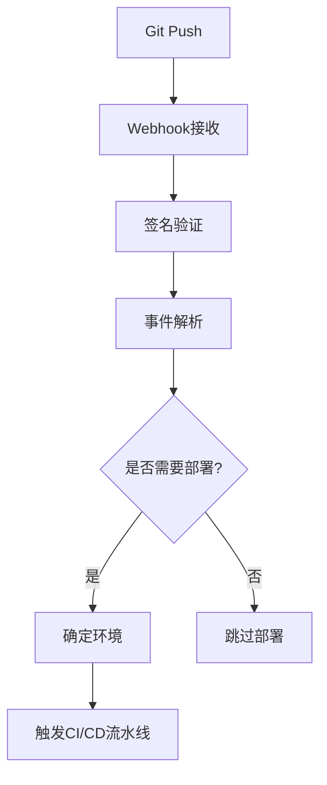
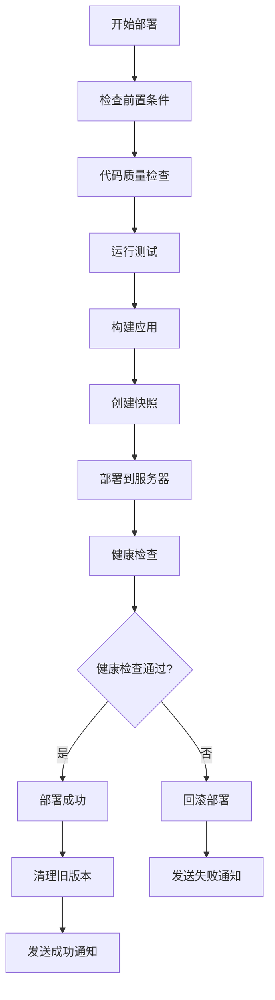
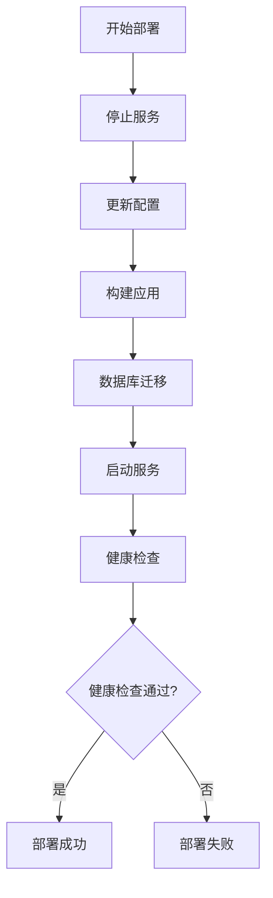

# JobFirst CI/CD 自动化指南

## 📋 概述

本指南介绍如何在腾讯云轻量应用服务器上实现完整的CI/CD自动化流程，支持前端、后端、数据库和配置管理的自动化部署。

## 🎯 CI/CD自动化支持

### ✅ **已实现的功能**

1. **自动化流水线** - 完整的CI/CD流水线脚本
2. **Git Webhook** - 自动触发部署
3. **代码质量检查** - ESLint、TypeScript、Go代码检查
4. **自动化测试** - 前端和后端测试集成
5. **构建自动化** - 前端和后端自动构建
6. **部署自动化** - 一键部署到腾讯云服务器
7. **健康检查** - 部署后自动健康检查
8. **版本管理** - 快照和回滚机制
9. **通知机制** - 部署状态通知

### 🛠️ **核心组件**

#### 1. CI/CD流水线 (`cicd-pipeline.sh`)
- **功能**: 完整的持续集成和持续部署流水线
- **支持**: 前端、后端、数据库、配置管理
- **特性**: 代码质量检查、自动化测试、构建、部署、健康检查

#### 2. Git Webhook (`git-webhook.sh`)
- **功能**: 接收Git事件，自动触发CI/CD流水线
- **支持**: GitHub、GitLab、Gitee等主流Git平台
- **特性**: 签名验证、事件解析、环境判断

#### 3. 部署脚本 (`deploy.sh`)
- **功能**: 在腾讯云服务器上执行部署操作
- **支持**: 服务管理、配置更新、健康检查
- **特性**: 服务启停、配置管理、状态监控

## 🚀 快速开始

### 1. 环境准备

确保您的环境具备以下条件：
- SSH密钥文件: `~/.ssh/basic.pem`
- 服务器访问权限: `ubuntu@101.33.251.158`
- 脚本执行权限: `chmod +x *.sh`

### 2. 部署CI/CD脚本

```bash
# 上传CI/CD脚本到服务器
scp -i ~/.ssh/basic.pem basic/scripts/cicd-pipeline.sh ubuntu@101.33.251.158:/opt/jobfirst/scripts/
scp -i ~/.ssh/basic.pem basic/scripts/git-webhook.sh ubuntu@101.33.251.158:/opt/jobfirst/scripts/
scp -i ~/.ssh/basic.pem basic/scripts/deploy.sh ubuntu@101.33.251.158:/opt/jobfirst/scripts/

# 设置执行权限
ssh -i ~/.ssh/basic.pem ubuntu@101.33.251.158 "chmod +x /opt/jobfirst/scripts/*.sh"
```

### 3. 配置Git Webhook

#### 3.1 启动Webhook服务器

```bash
# 在腾讯云服务器上启动Webhook服务器
ssh -i ~/.ssh/basic.pem ubuntu@101.33.251.158 "cd /opt/jobfirst && nohup ./scripts/git-webhook.sh start 8088 > /opt/jobfirst/logs/webhook.log 2>&1 &"
```

#### 3.2 配置Git平台Webhook

在您的Git平台（GitHub/GitLab/Gitee）中配置Webhook：

**Webhook URL**: `http://101.33.251.158:8088/webhook`

**Webhook Secret**: 设置一个安全的密钥

**触发事件**: 
- Push events
- Tag push events

### 4. 测试CI/CD流程

```bash
# 本地执行完整部署流程
./basic/scripts/cicd-pipeline.sh deploy production

# 快速部署（跳过测试）
./basic/scripts/cicd-pipeline.sh quick

# 仅运行测试
./basic/scripts/cicd-pipeline.sh test

# 健康检查
./basic/scripts/cicd-pipeline.sh health
```

## 📊 CI/CD流程详解

### 1. 触发阶段



### 2. CI/CD流水线



### 3. 部署流程



## 🛠️ 使用场景

### 场景1: 开发环境自动部署

```bash
# 推送到develop分支时自动部署到测试环境
git push origin develop
# Webhook自动触发 -> 部署到staging环境
```

### 场景2: 生产环境自动部署

```bash
# 推送到main分支时自动部署到生产环境
git push origin main
# Webhook自动触发 -> 部署到production环境
```

### 场景3: 标签发布

```bash
# 创建标签时自动部署到生产环境
git tag v1.0.0
git push origin v1.0.0
# Webhook自动触发 -> 部署到production环境
```

### 场景4: 手动部署

```bash
# 手动触发完整部署流程
./basic/scripts/cicd-pipeline.sh deploy production

# 快速部署（跳过测试）
./basic/scripts/cicd-pipeline.sh quick

# 回滚到指定快照
./basic/scripts/cicd-pipeline.sh rollback deploy-20250909-143022
```

## 🔧 配置说明

### 环境变量配置

```bash
# Webhook配置
export WEBHOOK_SECRET="your-secure-webhook-secret"

# 服务器配置
export SERVER_IP="101.33.251.158"
export SERVER_USER="ubuntu"
export SSH_KEY="~/.ssh/basic.pem"
export PROJECT_DIR="/opt/jobfirst"
```

### 分支策略

```bash
# 分支与环境的映射关系
main/master    -> production  # 生产环境
develop        -> staging     # 测试环境
feature/*      -> development # 开发环境
release/*      -> staging     # 预发布环境
hotfix/*       -> production  # 热修复
```

### 服务端口配置

```bash
# 微服务端口
basic-server:         8080
user-service:         8081
ai-service:           8206
resume:               8082
company-service:      8083
notification-service: 8084
banner-service:       8085
statistics-service:   8086
template-service:     8087

# 基础设施服务端口
mysql:                3306
redis:                6379
postgresql:           5432
nginx:                80
consul:               8500
webhook:              8088
frontend-dev:         10086
```

## 📈 监控和告警

### 1. 部署状态监控

```bash
# 查看部署日志
ssh -i ~/.ssh/basic.pem ubuntu@101.33.251.158 "tail -f /opt/jobfirst/logs/webhook.log"

# 查看CI/CD流水线日志
ssh -i ~/.ssh/basic.pem ubuntu@101.33.251.158 "tail -f /opt/jobfirst/logs/cicd.log"
```

### 2. 服务健康检查

```bash
# 使用zervigo工具检查服务状态
zervigo status

# 检查特定服务
zervigo frontend status
zervigo consul status
zervigo database status
```

### 3. 告警通知

CI/CD流水线支持多种通知方式：
- 邮件通知
- 钉钉/企业微信通知
- Slack通知
- 短信通知

## 🚨 故障排除

### 常见问题

1. **Webhook无法触发**
   ```bash
   # 检查Webhook服务器状态
   ssh -i ~/.ssh/basic.pem ubuntu@101.33.251.158 "ps aux | grep webhook"
   
   # 检查端口是否开放
   ssh -i ~/.ssh/basic.pem ubuntu@101.33.251.158 "netstat -tlnp | grep 8088"
   ```

2. **部署失败**
   ```bash
   # 查看部署日志
   ssh -i ~/.ssh/basic.pem ubuntu@101.33.251.158 "tail -50 /opt/jobfirst/logs/deploy.log"
   
   # 手动回滚
   ./basic/scripts/cicd-pipeline.sh rollback <快照名称>
   ```

3. **服务启动失败**
   ```bash
   # 检查服务状态
   zervigo status
   
   # 查看服务日志
   ssh -i ~/.ssh/basic.pem ubuntu@101.33.251.158 "tail -50 /opt/jobfirst/logs/basic-server.log"
   ```

### 紧急恢复

```bash
# 1. 停止所有服务
ssh -i ~/.ssh/basic.pem ubuntu@101.33.251.158 "cd /opt/jobfirst && ./scripts/deploy.sh stop"

# 2. 回滚到最新快照
ssh -i ~/.ssh/basic.pem ubuntu@101.33.251.158 "cd /opt/jobfirst && ./version-manager.sh rollback latest"

# 3. 重启服务
ssh -i ~/.ssh/basic.pem ubuntu@101.33.251.158 "cd /opt/jobfirst && ./scripts/deploy.sh start"

# 4. 验证恢复
./basic/scripts/cicd-pipeline.sh health
```

## 📞 支持信息

### 相关文档

- [超级管理员控制指南](./SUPER_ADMIN_CONTROL_GUIDE.md)
- [腾讯云部署指南](./TENCENT_CLOUD_DEPLOYMENT_GUIDE.md)
- [快速开始指南](../frontend-taro/docs/QUICK_START.md)

### 联系方式

- **技术支持**: admin@jobfirst.com
- **紧急联系**: 24/7 技术支持热线

---

**文档版本**: v1.0.0  
**最后更新**: 2025年9月9日  
**维护人员**: AI Assistant
