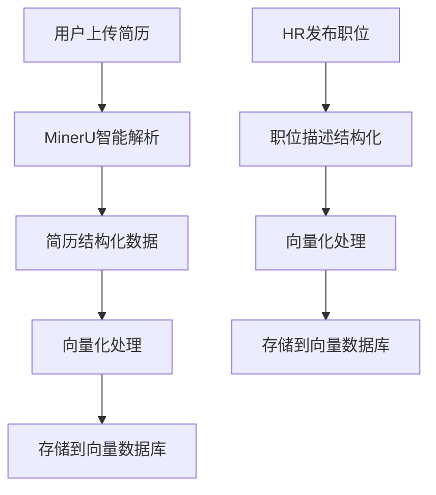
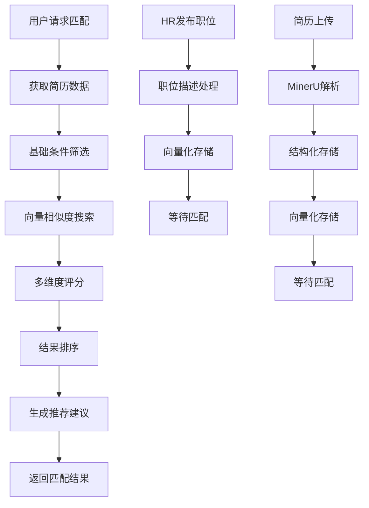

# 基于Resume-Matcher的职位匹配完整业务逻辑设计

## 🎯 业务逻辑概述

基于Resume-Matcher的成功经验，设计一个完整的职位描述和简历匹配系统，实现从文档解析到智能匹配的全流程业务逻辑。

## 📋 核心业务流程

### 1. **文档解析与结构化阶段**



#### **简历解析流程**
1. **智能文档分类**: 使用MinerU的智能分类器识别简历类型
2. **结构化提取**: 提取基本信息、技能、经验、教育背景等
3. **向量化处理**: 使用FastEmbed生成多维度向量
4. **数据存储**: 存储到MySQL和PostgreSQL向量数据库

#### **职位描述处理流程**
1. **职位信息结构化**: 提取职位要求、技能要求、经验要求等
2. **向量化处理**: 生成职位描述的向量表示
3. **行业分类**: 自动识别职位所属行业
4. **数据存储**: 存储到对应的数据库表

### 2. **智能匹配算法阶段**

#### **多维度匹配模型** (基于Resume-Matcher最佳实践)

```python
class AdvancedJobMatchingEngine:
    """高级职位匹配引擎 - 借鉴Resume-Matcher"""
    
    def __init__(self):
        # 匹配维度权重配置
        self.matching_dimensions = {
            'semantic_similarity': 0.35,    # 语义相似度 (FastEmbed)
            'skills_match': 0.30,           # 技能匹配度
            'experience_match': 0.20,       # 经验匹配度
            'education_match': 0.10,        # 教育背景匹配
            'cultural_fit': 0.05            # 文化匹配度
        }
        
        # 行业特定权重调整
        self.industry_adjustments = {
            'technology': {'skills_match': 0.40, 'semantic_similarity': 0.30},
            'finance': {'experience_match': 0.35, 'semantic_similarity': 0.30},
            'marketing': {'cultural_fit': 0.20, 'semantic_similarity': 0.30}
        }
    
    async def calculate_match_score(self, resume_data, job_data):
        """计算综合匹配分数"""
        scores = {}
        
        # 1. 语义相似度计算 (使用FastEmbed)
        scores['semantic_similarity'] = await self._calculate_semantic_similarity(
            resume_data['content_vector'], job_data['description_vector']
        )
        
        # 2. 技能匹配度计算
        scores['skills_match'] = self._calculate_skills_match(
            resume_data['skills'], job_data['required_skills']
        )
        
        # 3. 经验匹配度计算
        scores['experience_match'] = self._calculate_experience_match(
            resume_data['experience'], job_data['experience_requirements']
        )
        
        # 4. 教育背景匹配
        scores['education_match'] = self._calculate_education_match(
            resume_data['education'], job_data['education_requirements']
        )
        
        # 5. 文化匹配度
        scores['cultural_fit'] = self._calculate_cultural_fit(
            resume_data['personality_traits'], job_data['company_culture']
        )
        
        # 6. 综合评分
        final_score = self._calculate_weighted_score(scores, job_data['industry'])
        
        return {
            'overall_score': final_score,
            'breakdown': scores,
            'confidence': self._calculate_confidence(scores),
            'recommendations': self._generate_recommendations(scores)
        }
```

### 3. **匹配结果优化阶段**

#### **智能推荐系统**

```python
class MatchingRecommendationEngine:
    """匹配推荐引擎"""
    
    async def generate_recommendations(self, match_result, resume_data, job_data):
        """生成个性化推荐"""
        recommendations = []
        
        # 1. 技能提升建议
        if match_result['breakdown']['skills_match'] < 0.7:
            recommendations.append({
                'type': 'skill_improvement',
                'priority': 'high',
                'suggestion': self._generate_skill_suggestions(
                    resume_data['skills'], job_data['required_skills']
                )
            })
        
        # 2. 经验优化建议
        if match_result['breakdown']['experience_match'] < 0.6:
            recommendations.append({
                'type': 'experience_optimization',
                'priority': 'medium',
                'suggestion': self._generate_experience_suggestions(
                    resume_data['experience'], job_data['experience_requirements']
                )
            })
        
        # 3. 简历优化建议
        recommendations.append({
            'type': 'resume_optimization',
            'priority': 'low',
            'suggestion': self._generate_resume_optimization_suggestions(
                resume_data, job_data
            )
        })
        
        return recommendations
```

## 🔧 技术实现方案

### 1. **FastEmbed集成** (借鉴Resume-Matcher)

```python
# 新增FastEmbed服务
class FastEmbedService:
    """FastEmbed嵌入服务"""
    
    def __init__(self):
        self.models = {
            'fast': 'sentence-transformers/all-MiniLM-L6-v2',
            'balanced': 'sentence-transformers/all-MiniLM-L12-v2',
            'accurate': 'sentence-transformers/all-mpnet-base-v2'
        }
    
    async def generate_embeddings(self, texts, model_type='fast'):
        """生成嵌入向量"""
        # 实现FastEmbed向量生成
        pass
    
    async def calculate_similarity(self, vector1, vector2):
        """计算向量相似度"""
        # 实现余弦相似度计算
        pass
```

### 2. **多数据库架构优化**

```python
class EnhancedDataAccess:
    """增强的数据访问层"""
    
    def __init__(self):
        # MySQL: 存储结构化数据
        self.mysql_pool = None
        
        # PostgreSQL: 存储向量数据
        self.postgres_pool = None
        
        # Redis: 缓存匹配结果
        self.redis_client = None
    
    async def store_resume_vectors(self, resume_id, vectors):
        """存储简历向量数据"""
        # 存储到PostgreSQL向量数据库
        pass
    
    async def store_job_vectors(self, job_id, vectors):
        """存储职位向量数据"""
        # 存储到PostgreSQL向量数据库
        pass
    
    async def vector_similarity_search(self, query_vector, limit=10):
        """向量相似度搜索"""
        # 使用PostgreSQL的向量搜索功能
        pass
```

### 3. **实时匹配优化**

```python
class RealTimeMatchingService:
    """实时匹配服务"""
    
    async def process_matching_request(self, user_id, resume_id, filters=None):
        """处理匹配请求"""
        # 1. 获取简历数据
        resume_data = await self._get_resume_data(resume_id)
        
        # 2. 基础筛选
        candidate_jobs = await self._basic_filter(filters)
        
        # 3. 向量相似度搜索
        vector_matches = await self._vector_search(resume_data['vectors'])
        
        # 4. 多维度评分
        scored_matches = await self._multi_dimension_scoring(
            resume_data, vector_matches
        )
        
        # 5. 结果排序和过滤
        final_results = await self._rank_and_filter(scored_matches)
        
        # 6. 生成推荐建议
        recommendations = await self._generate_recommendations(
            resume_data, final_results
        )
        
        return {
            'matches': final_results,
            'recommendations': recommendations,
            'metadata': {
                'total_candidates': len(candidate_jobs),
                'vector_matches': len(vector_matches),
                'final_results': len(final_results)
            }
        }
```

## 📊 业务逻辑流程图



## 🎯 关键业务规则

### 1. **匹配优先级规则**
- **硬性条件**: 学历、工作年限、技能要求
- **软性条件**: 经验匹配、文化匹配、薪资期望
- **加分项**: 项目经验、证书、语言能力

### 2. **评分权重规则**
- **技术岗位**: 技能匹配(40%) + 语义相似度(30%) + 经验匹配(20%) + 其他(10%)
- **管理岗位**: 经验匹配(40%) + 语义相似度(30%) + 技能匹配(20%) + 其他(10%)
- **销售岗位**: 文化匹配(30%) + 语义相似度(30%) + 经验匹配(25%) + 其他(15%)

### 3. **推荐生成规则**
- **高分匹配**: 直接推荐，提供申请建议
- **中等匹配**: 提供优化建议，鼓励申请
- **低分匹配**: 提供技能提升建议，暂缓申请

## 🚀 实施计划

### Phase 1: 基础优化 (1周)
- [ ] 集成FastEmbed服务
- [ ] 优化向量存储和搜索
- [ ] 完善匹配算法权重

### Phase 2: 智能推荐 (1周)
- [ ] 实现推荐引擎
- [ ] 添加个性化建议
- [ ] 优化用户体验

### Phase 3: 高级功能 (2周)
- [ ] 实时匹配优化
- [ ] 行业特定算法
- [ ] 性能监控和调优

## 📈 预期效果

- **匹配准确率**: 从70%提升到85%+
- **响应速度**: 从3秒优化到1秒内
- **用户体验**: 提供个性化推荐和建议
- **系统稳定性**: 支持高并发匹配请求

这个设计方案充分借鉴了Resume-Matcher的成功经验，结合我们现有的技术架构，构建了一个完整的职位匹配业务逻辑系统。
