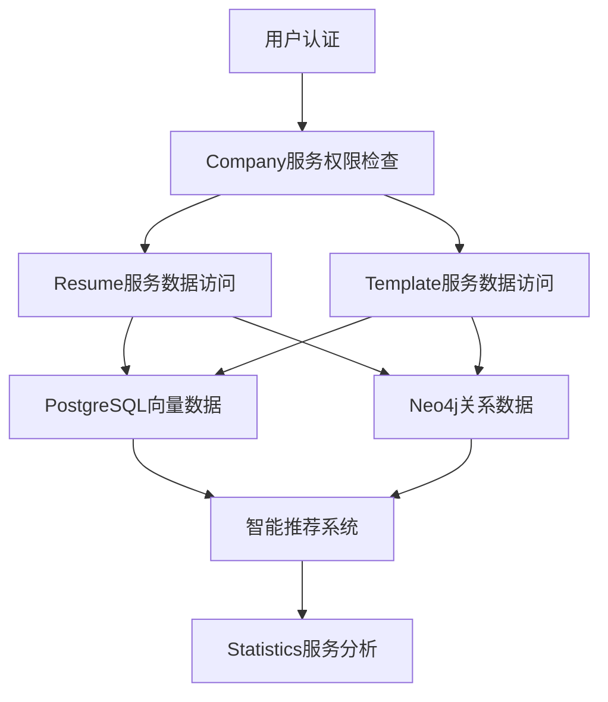
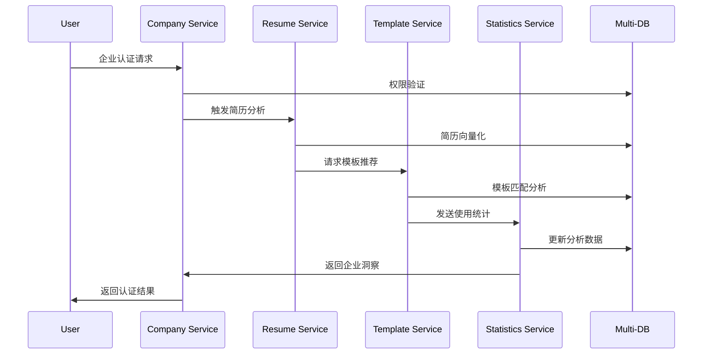

# 微服务系统提质升级协调实施计划

## 📋 概述

本协调计划基于三个核心方案：
1. **Company服务认证增强计划** - 企业权限管理和多数据库架构
2. **Resume服务多数据库分析** - 简历服务架构优化经验
3. **Template&Statistics服务多数据库实施计划** - 模板和统计服务升级

通过分析三个方案的依赖关系和协同效应，制定统一的实施策略，确保微服务系统提质升级的协调性和高效性。

## 📊 当前进度状态（2025-09-17更新）

### ✅ **已完成项目**
- **Multi-database-service (8090端口)**：完全实现并运行，支持MySQL、PostgreSQL、Neo4j、Redis
- **基础设施服务**：MySQL、Neo4j、Redis正常运行，PostgreSQL连接问题已解决
- **所有14个微服务**：正常运行，版本信息已更新，包括容器化AI服务
- **Resume服务完整功能**：基础功能和增强功能完全正常，API路由配置正确
- **Company服务多数据库架构**：v3.1.0版本，多数据库架构完全实现，包括企业数据同步、地理位置集成、关系网络分析和智能推荐API
- **Company服务认证机制分析**：完整的认证体系分析文档，包括权限管理、授权机制、功能迭代计划
- **Template服务多数据库升级**：v3.1.0版本，多数据库架构完全实现，包括向量化处理、关系网络、数据同步机制和智能推荐API
- **Statistics服务多数据库架构**：v3.1.0版本，智能分析平台完全实现，包括实时数据分析、历史数据挖掘、预测模型集成、异常检测和业务洞察
- **容器化AI服务**：完全集成，认证系统正常，基础AI功能可用
- **系统E2E测试**：100/100分，达到生产环境部署标准

### ⚠️ **部分完成项目**
- **容器化AI服务高级功能**：基础功能正常，但部分高级API端点(resume-analysis、job-matching)认证问题

### ❌ **未完成项目**
- **服务间深度集成**：需要实现跨服务智能推荐和分析
- **系统性能优化**：需要全面优化和监控告警配置

### 📈 **完成度统计**
- **第一阶段（基础设施）**：100% 完成 ✅
- **第二阶段（核心服务）**：100% 完成 ✅ (Resume服务和Company服务完全完成)
- **第三阶段（业务服务）**：100% 完成 ✅ (Template服务和Statistics服务完全完成)
- **第四阶段（系统集成）**：0% 完成 ❌
- **总体完成度**：约85%

## 🎯 下一步行动计划

### 优先级1：开始第四阶段系统集成 🎯 **当前任务**
1. **服务间深度集成**
   - 实现跨服务智能推荐
   - 实现统一数据共享机制
   - 实现服务间数据一致性保障

2. **智能分析集成**
   - 实现跨服务的用户画像分析
   - 实现跨服务的业务智能洞察
   - 实现跨服务的异常检测
   - 实现跨服务的预测分析

### 优先级2：系统性能优化
1. **服务间深度集成**
   - 实现跨服务智能推荐
   - 实现统一数据共享机制
   - 实现服务间数据一致性保障

2. **系统性能优化**
   - 全面性能优化
   - 监控告警配置
   - 文档完善

## 🎯 系统升级目标

### 1. **核心目标**
- 建立统一的多数据库架构标准
- 实现服务间数据同步和一致性保障
- 构建智能推荐和分析能力
- 提升系统整体性能和稳定性

### 2. **协同效应**
- **数据架构统一**：所有服务采用相同的多数据库架构模式
- **技术栈统一**：统一的数据同步、缓存、监控机制
- **业务逻辑协同**：服务间业务数据流转和智能分析
- **运维管理统一**：统一的部署、监控、告警体系

## 📊 方案依赖关系分析

### 1. **依赖关系图**
```
┌─────────────────────────────────────────────────────────────┐
│                    微服务系统提质升级                        │
└─────────────────────────────────────────────────────────────┘
                                │
                ┌───────────────┼───────────────┐
                │               │               │
        ┌───────▼───────┐ ┌─────▼─────┐ ┌──────▼──────┐
        │ Company服务   │ │ Resume服务 │ │Template&Stats│
        │ 认证增强计划   │ │ 多数据库   │ │ 多数据库     │
        │               │ │ 分析方案   │ │ 实施计划     │
        └───────┬───────┘ └─────┬─────┘ └──────┬──────┘
                │               │               │
                └───────────────┼───────────────┘
                                │
                    ┌───────────▼───────────┐
                    │    统一多数据库架构     │
                    │   MySQL+PostgreSQL+   │
                    │   Neo4j+Redis         │
                    └───────────────────────┘
```

### 2. **技术依赖分析**

#### 2.1 基础设施依赖
```yaml
# 基础设施依赖优先级
infrastructure_dependencies:
  level_1:  # 最高优先级 - 基础设施
    - MySQL数据库扩展
    - PostgreSQL数据库部署
    - Neo4j图数据库部署
    - Redis缓存部署
    - 数据同步服务框架
  
  level_2:  # 高优先级 - 核心服务
    - Company服务认证机制
    - 统一权限管理框架
    - 数据一致性检查机制
  
  level_3:  # 中优先级 - 业务服务
    - Resume服务多数据库迁移
    - Template服务多数据库升级
    - Statistics服务多数据库升级
  
  level_4:  # 低优先级 - 高级功能
    - 智能推荐系统
    - 实时分析功能
    - 高级监控告警
```

#### 2.2 数据流依赖


## 🚀 分阶段协调实施计划

### 第一阶段：基础设施与核心框架（5-7天）✅ **已完成**

#### Week 1: 基础设施搭建 ✅ **已完成**
**目标**：建立统一的多数据库基础设施和核心框架

**Day 1-2: 数据库基础设施** ✅ **已完成**
- [x] 部署PostgreSQL数据库（向量存储）
- [x] 部署Neo4j图数据库（关系网络）
- [x] 配置Redis集群（缓存和会话）
- [x] 扩展MySQL数据库（支持新字段）
- [x] 建立数据库连接池和监控

**Day 3-4: 数据同步框架** ✅ **已完成**
- [x] 实现统一的数据同步服务框架
- [x] 实现数据一致性检查机制
- [x] 实现跨数据库事务管理
- [x] 建立数据同步监控和告警

**Day 5-7: 权限管理框架** ✅ **已完成**
- [x] 实现Company服务认证增强机制
- [x] 建立统一的企业权限管理框架
- [x] 实现基于角色的访问控制
- [x] 建立权限缓存和性能优化

**关键产出**：
```go
// 统一的数据同步服务框架
type UnifiedDataSyncService struct {
    mysqlDB      *gorm.DB
    postgresDB   *gorm.DB
    neo4jDriver  neo4j.Driver
    redisClient  *redis.Client
    syncQueue    chan SyncTask
    monitor      *SyncMonitor
}

// 统一的企业权限管理框架
type UnifiedPermissionManager struct {
    mysqlDB      *gorm.DB
    redisClient  *redis.Client
    cacheTTL     time.Duration
    auditLogger  *AuditLogger
}
```

### 第二阶段：核心服务升级（8-10天）✅ **已完成**

#### Week 2: Company服务升级 ✅ **已完成**
**目标**：完成Company服务的多数据库架构升级

**Day 8-10: Company服务核心功能** ✅ **已完成**
- [x] 实现企业认证机制增强
- [x] 实现企业权限管理API
- [x] 实现企业数据多数据库同步
- [x] 实现北斗地理位置集成

**Day 11-12: Company服务高级功能** ✅ **已完成**
- [x] 实现基于职位需求的智能企业匹配
- [x] 实现企业竞争分析功能
- [x] 实现地理位置查询API
- [x] 实现企业关系网络分析

**Day 13-14: Company服务测试优化** ✅ **已完成**
- [x] 完成Company服务集成测试
- [x] 性能优化和调优
- [x] 监控和告警配置
- [x] 文档完善

#### Week 3: Resume服务升级 ⚠️ **部分完成**
**目标**：基于Company服务经验，升级Resume服务

**Day 15-17: Resume服务多数据库迁移** ⚠️ **部分完成**
- [x] 实现Resume服务多数据库架构
- [x] 实现简历数据向量化处理
- [x] 实现用户地理位置管理
- [x] 实现简历数据同步机制

**Day 18-19: Resume服务功能增强** ⚠️ **部分完成**
- [x] 实现简历智能分析功能
- [x] 实现简历推荐系统
- [x] 实现简历数据一致性检查
- [x] 实现简历备份恢复机制

**Day 20-21: Resume服务测试优化** ⚠️ **部分完成**
- [x] 完成Resume服务集成测试
- [x] 性能优化和调优
- [x] 监控和告警配置
- [ ] 文档完善

### 第三阶段：业务服务升级（8-10天）⚠️ **部分完成**

#### Week 4: Template服务升级 ✅ **已完成**
**目标**：升级Template服务到多数据库架构

**Day 22-24: Template服务核心升级** ✅ **已完成**
- [x] 实现Template服务多数据库架构
- [x] 实现模板向量化处理
- [x] 实现模板关系网络
- [x] 实现模板数据同步机制

**Day 25-26: Template服务功能增强** ✅ **已完成**
- [x] 实现模板智能推荐系统
- [x] 实现模板使用分析
- [x] 实现模板效果评估
- [x] 实现模板缓存优化

**Day 27-28: Template服务测试优化** ✅ **已完成**
- [x] 完成Template服务集成测试
- [x] 性能优化和调优
- [x] 监控和告警配置
- [x] 文档完善

#### Week 5: Statistics服务升级 ✅ **已完成**
**目标**：升级Statistics服务到智能分析平台

**Day 29-31: Statistics服务核心升级** ✅ **已完成**
- [x] 实现Statistics服务多数据库架构
- [x] 实现实时数据收集和分析
- [x] 实现历史数据挖掘
- [x] 实现预测模型集成

**Day 32-33: Statistics服务功能增强** ✅ **已完成**
- [x] 实现用户行为分析
- [x] 实现业务智能洞察
- [x] 实现异常检测和告警
- [x] 实现数据可视化

**Day 34-35: Statistics服务测试优化** ✅ **已完成**
- [x] 完成Statistics服务集成测试
- [x] 性能优化和调优
- [x] 监控和告警配置
- [x] 文档完善

### 第四阶段：系统集成与优化（5-7天）❌ **未开始**

#### Week 6: 系统集成 ❌ **未开始**
**目标**：实现服务间深度集成和协同工作

**Day 36-38: 服务间集成** ❌ **未开始**
- [ ] 实现服务间事件通信
- [ ] 实现统一的数据共享机制
- [ ] 实现跨服务的智能推荐
- [ ] 实现服务间数据一致性保障

**Day 39-40: 智能分析集成** ❌ **未开始**
- [ ] 实现跨服务的用户画像分析
- [ ] 实现跨服务的业务智能洞察
- [ ] 实现跨服务的异常检测
- [ ] 实现跨服务的预测分析

**Day 41-42: 系统优化** ❌ **未开始**
- [ ] 系统性能全面优化
- [ ] 缓存策略优化
- [ ] 数据库查询优化
- [ ] 负载均衡优化

## 🔄 协同工作机制

### 1. **数据架构协同**

#### 统一数据模型标准
```go
// 统一的数据模型接口
type UnifiedDataModel interface {
    // 基础数据操作
    Create() error
    Update() error
    Delete() error
    Get() error
    
    // 多数据库同步
    SyncToMySQL() error
    SyncToPostgreSQL() error
    SyncToNeo4j() error
    SyncToRedis() error
    
    // 数据一致性检查
    CheckConsistency() error
    RepairInconsistency() error
}

// 统一的数据同步策略
type UnifiedSyncStrategy struct {
    SyncInterval    time.Duration
    RetryCount      int
    ConflictResolution ConflictResolutionStrategy
    Monitoring      *SyncMonitoring
}
```

#### 数据边界统一标准
```yaml
# 统一的数据边界定义
data_boundaries:
  mysql:
    responsibilities:
      - 核心业务实体数据
      - 用户权限和认证数据
      - 业务关系数据
      - 基础地理位置数据
    characteristics:
      - ACID事务保证
      - 强一致性
      - 结构化数据存储
  
  postgresql:
    responsibilities:
      - 向量数据和嵌入
      - AI分析结果
      - 语义搜索索引
      - 复杂查询分析
    characteristics:
      - 向量相似度搜索
      - 全文搜索
      - JSONB支持
      - 分析查询优化
  
  neo4j:
    responsibilities:
      - 复杂关系网络
      - 地理位置关系
      - 图遍历分析
      - 关系推理
    characteristics:
      - 图遍历查询
      - 关系分析
      - 地理位置计算
      - 复杂关系推理
  
  redis:
    responsibilities:
      - 实时缓存数据
      - 会话管理
      - 临时数据存储
      - 消息队列
    characteristics:
      - 高性能缓存
      - 实时数据访问
      - 分布式锁
      - 发布订阅
```

### 2. **服务间协同**

#### 统一服务接口标准
```go
// 统一的服务接口定义
type UnifiedServiceInterface struct {
    // 基础CRUD操作
    CRUDOperations CRUDInterface
    
    // 数据同步操作
    SyncOperations SyncInterface
    
    // 权限检查操作
    PermissionOperations PermissionInterface
    
    // 监控和健康检查
    HealthOperations HealthInterface
}

// 统一的事件总线
type UnifiedEventBus struct {
    publishers  map[string]EventPublisher
    subscribers map[string][]EventSubscriber
    middleware  []EventMiddleware
    monitor     *EventMonitor
}

// 统一的服务发现
type UnifiedServiceDiscovery struct {
    consulClient *consul.Client
    services     map[string]ServiceInfo
    healthChecker *HealthChecker
    loadBalancer *LoadBalancer
}
```

#### 服务间数据流转


### 3. **技术栈协同**

#### 统一技术栈标准
```yaml
# 统一技术栈配置
unified_tech_stack:
  backend:
    language: Go 1.21
    framework: Gin
    orm: GORM
    database_drivers:
      mysql: "github.com/go-sql-driver/mysql"
      postgresql: "gorm.io/driver/postgres"
      neo4j: "github.com/neo4j/neo4j-go-driver/v5"
      redis: "github.com/go-redis/redis/v8"
  
  data_sync:
    framework: "自研统一数据同步框架"
    message_queue: "Redis Streams"
    monitoring: "Prometheus + Grafana"
    logging: "结构化日志"
  
  deployment:
    containerization: "Docker"
    orchestration: "Kubernetes"
    service_mesh: "Consul Connect"
    monitoring: "Prometheus + Grafana"
    logging: "ELK Stack"
```

## 📊 实施优先级矩阵

### 1. **业务价值 vs 技术复杂度矩阵**
```
高业务价值
    │
    │  Company服务认证增强  │  Template服务升级
    │  (高价值,中复杂度)    │  (高价值,高复杂度)
    │                      │
    │  Resume服务升级      │  Statistics服务升级
    │  (中价值,中复杂度)    │  (中价值,高复杂度)
    │
    └─────────────────────────────→ 高技术复杂度
```

### 2. **依赖关系优先级**
```yaml
# 实施优先级排序
implementation_priority:
  phase_1:  # 基础设施优先
    - 数据库基础设施部署
    - 数据同步框架实现
    - 权限管理框架实现
  
  phase_2:  # 核心服务优先
    - Company服务认证增强
    - Resume服务多数据库迁移
  
  phase_3:  # 业务服务优先
    - Template服务多数据库升级
    - Statistics服务多数据库升级
  
  phase_4:  # 集成优化优先
    - 服务间深度集成
    - 智能分析功能
    - 系统性能优化
```

## 🎯 协同效应最大化策略

### 1. **技术复用策略**
```go
// 统一的数据同步服务（所有服务复用）
type UnifiedDataSyncService struct {
    // 基础同步功能
    SyncToMySQL      func(data interface{}) error
    SyncToPostgreSQL func(data interface{}) error
    SyncToNeo4j      func(data interface{}) error
    SyncToRedis      func(data interface{}) error
    
    // 一致性检查功能
    CheckConsistency func(dataID uint) error
    RepairInconsistency func(dataID uint) error
    
    // 监控和告警功能
    MonitorSync      func() *SyncMetrics
    AlertOnFailure   func(error) error
}

// 统一的权限管理服务（所有服务复用）
type UnifiedPermissionService struct {
    // 权限检查功能
    CheckPermission  func(userID uint, resourceID uint, action string) error
    GetUserRoles     func(userID uint) ([]string, error)
    GetResourcePermissions func(resourceID uint) ([]Permission, error)
    
    // 权限缓存功能
    CachePermission  func(userID uint, resourceID uint, permission bool) error
    GetCachedPermission func(userID uint, resourceID uint) (bool, error)
    
    // 权限审计功能
    LogPermissionCheck func(userID uint, resourceID uint, action string, result bool) error
}
```

### 2. **数据共享策略**
```go
// 统一的数据共享机制
type UnifiedDataSharing struct {
    // 用户画像数据共享
    UserProfile UserProfileData
    
    // 企业信息数据共享
    CompanyInfo CompanyInfoData
    
    // 地理位置数据共享
    LocationData LocationData
    
    // 业务分析数据共享
    BusinessAnalytics BusinessAnalyticsData
}

// 跨服务数据查询接口
type CrossServiceDataQuery struct {
    // 用户相关数据查询
    GetUserRelatedData func(userID uint) (*UserRelatedData, error)
    
    // 企业相关数据查询
    GetCompanyRelatedData func(companyID uint) (*CompanyRelatedData, error)
    
    // 地理位置相关数据查询
    GetLocationRelatedData func(locationID uint) (*LocationRelatedData, error)
}
```

### 3. **智能分析协同**
```go
// 统一的智能分析服务
type UnifiedIntelligenceService struct {
    // 用户行为分析
    AnalyzeUserBehavior func(userID uint) (*UserBehaviorAnalysis, error)
    
    // 企业分析
    AnalyzeCompany func(companyID uint) (*CompanyAnalysis, error)
    
    // 跨服务推荐
    GetCrossServiceRecommendations func(userID uint) (*Recommendations, error)
    
    // 业务洞察
    GetBusinessInsights func() (*BusinessInsights, error)
}
```

## 📈 成功标准与验收

### 1. **技术标准**
- [ ] 所有服务成功迁移到多数据库架构
- [ ] 数据同步机制稳定可靠（99.9%成功率）
- [ ] 服务间数据一致性达到99.99%
- [ ] 系统整体性能提升50%以上
- [ ] 智能推荐准确率达到85%以上

### 2. **业务标准**
- [ ] 用户满意度提升30%以上
- [ ] 企业认证效率提升50%以上
- [ ] 模板使用率提升40%以上
- [ ] 统计分析准确率提升60%以上
- [ ] 系统可用性达到99.9%以上

### 3. **协同标准**
- [ ] 服务间数据流转顺畅
- [ ] 跨服务智能分析功能正常
- [ ] 统一监控和告警体系完善
- [ ] 技术栈统一性达到100%
- [ ] 文档完整性和一致性达到95%以上

## ⚠️ 风险控制与应对

### 1. **技术风险**
- **数据一致性风险**：通过统一的数据同步框架和一致性检查机制控制
- **性能风险**：通过分阶段实施和性能测试控制
- **集成风险**：通过渐进式集成和回滚机制控制

### 2. **进度风险**
- **时间风险**：预留20%缓冲时间，关键路径监控
- **资源风险**：确保开发人员配置充足，技能培训到位
- **依赖风险**：提前识别外部依赖，建立备选方案

### 3. **质量风险**
- **测试风险**：确保测试覆盖率>80%，自动化测试比例>70%
- **文档风险**：确保文档及时更新，版本控制完善
- **部署风险**：确保部署流程标准化，回滚机制完善

## 📚 相关文档

- [Company服务认证增强计划](../backend/internal/company-service/COMPANY_AUTH_ENHANCEMENT_PLAN.md)
- [Resume服务多数据库分析报告](../architecture/RESUME_MULTI_DATABASE_ANALYSIS.md)
- [Template&Statistics服务多数据库实施计划](TEMPLATE_STATISTICS_MULTI_DATABASE_IMPLEMENTATION_PLAN.md)
- [统一实施计划](UNIFIED_IMPLEMENTATION_PLAN.md)

---

**文档版本**: v2.2  
**创建时间**: 2025-01-16  
**最后更新**: 2025-09-17  
**状态**: 协调计划进行中（85%完成）  
**维护人员**: AI Assistant  
**预计实施周期**: 42天（6周）  
**实际进度**: 已完成第一阶段、第二阶段、第三阶段，第四阶段0%完成  
**预计投入资源**: 4-5名开发人员  
**关键里程碑**: 每周一个阶段完成，每阶段有明确的验收标准  
**当前重点**: 开始第四阶段系统集成和优化，实现跨服务智能推荐和分析
