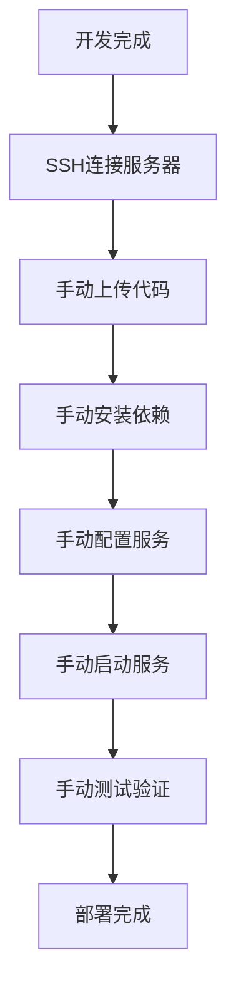
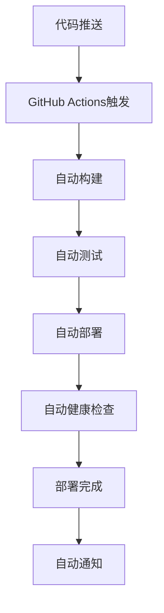

# 阿里云 vs 腾讯云部署方案对比分析

## 📊 方案概览对比

### 当前架构设计

| 方案 | 腾讯云 | 阿里云 |
|------|--------|--------|
| **用途** | 开发环境 | 生产环境 |
| **部署方式** | 手动部署 | 自动CI/CD |
| **服务器类型** | 轻量应用服务器 | ECS云服务器 |
| **容器化** | 手动安装 | Docker化部署 |
| **环境隔离** | 单环境 | 多环境隔离 |

## 🏗️ 架构设计对比

### 腾讯云架构（开发环境）
```
开发环境 -> 腾讯云轻量服务器 (101.33.251.158)
├── 手动部署
├── 组件化安装
├── 直接运行
└── 开发调试
```

### 阿里云架构（生产环境）
```
GitHub Actions -> 阿里云ECS
├── 自动CI/CD
├── Docker容器化
├── 多环境支持
└── 生产部署
```

## 💰 成本对比分析

### 腾讯云成本（开发环境）
```bash
# 轻量应用服务器
配置: 2核2GB 3M带宽 40GB存储
成本: ~50元/月
特点: 固定配置，成本低
```

### 阿里云成本（生产环境）
```bash
# ECS云服务器
配置: 2核4GB 5M带宽 40GB存储
成本: ~200元/月

# RDS数据库（可选）
配置: 1核2GB 20GB存储
成本: ~150元/月

# 总成本: ~350元/月
```

## 🔧 技术实现对比

### 1. 部署方式对比

#### 腾讯云部署方式
```bash
# 手动部署流程
1. SSH连接到服务器
2. 手动安装依赖
3. 手动配置服务
4. 手动启动服务
5. 手动监控状态

# 特点
- 简单直接
- 适合开发调试
- 需要手动操作
- 容易出错
```

#### 阿里云部署方式
```bash
# 自动CI/CD流程
1. 代码推送到GitHub
2. GitHub Actions自动触发
3. 自动构建和测试
4. 自动部署到阿里云
5. 自动健康检查

# 特点
- 全自动化
- 适合生产环境
- 减少人为错误
- 提高效率
```

### 2. 容器化对比

#### 腾讯云容器化
```bash
# 手动安装方式
- 直接在服务器上安装MySQL、Redis等
- 手动配置服务
- 手动管理进程
- 环境依赖复杂

# 优势
- 资源占用少
- 配置灵活
- 适合开发环境

# 劣势
- 部署复杂
- 环境不一致
- 难以扩展
```

#### 阿里云容器化
```bash
# Docker容器化方式
- 使用Docker Compose编排
- 容器化所有服务
- 环境隔离
- 易于扩展

# 优势
- 环境一致
- 易于部署
- 易于扩展
- 易于维护

# 劣势
- 资源占用多
- 学习成本高
```

### 3. 环境管理对比

#### 腾讯云环境管理
```bash
# 单环境管理
- 只有一个开发环境
- 所有服务在同一服务器
- 手动管理配置
- 简单但不够灵活

# 配置示例
environment: development
server: 101.33.251.158
services: all-in-one
```

#### 阿里云环境管理
```bash
# 多环境管理
- 支持development、staging、production
- 环境隔离
- 自动环境切换
- 灵活但复杂

# 配置示例
environments:
  - development
  - staging  
  - production
deployment: automated
```

## 🚀 部署流程对比

### 腾讯云部署流程


### 阿里云部署流程


## 📋 功能特性对比

### 腾讯云特性
```bash
✅ 优势:
- 成本低（50元/月）
- 配置简单
- 适合开发调试
- 快速启动
- 资源充足

⚠️ 劣势:
- 手动部署
- 环境不一致
- 难以扩展
- 缺乏自动化
- 监控能力弱
```

### 阿里云特性
```bash
✅ 优势:
- 全自动化部署
- 环境隔离
- 易于扩展
- 监控完善
- 生产就绪

⚠️ 劣势:
- 成本高（350元/月）
- 配置复杂
- 学习成本高
- 依赖GitHub Actions
- 需要Docker知识
```

## 🔒 安全性对比

### 腾讯云安全性
```bash
# 安全措施
- SSH密钥认证
- 防火墙配置
- 手动安全更新
- 基础监控

# 安全级别: 中等
# 适合: 开发环境
```

### 阿里云安全性
```bash
# 安全措施
- SSH密钥认证
- 防火墙配置
- 自动安全更新
- 完善监控
- 环境隔离
- 访问控制

# 安全级别: 高
# 适合: 生产环境
```

## 📊 监控和运维对比

### 腾讯云监控
```bash
# 监控方式
- 手动检查服务状态
- 基础系统监控
- 简单日志管理
- 手动故障排除

# 监控工具
- 系统命令（top, df, free）
- 简单脚本
- 手动日志查看
```

### 阿里云监控
```bash
# 监控方式
- 自动健康检查
- 完善系统监控
- 结构化日志管理
- 自动故障恢复

# 监控工具
- Prometheus + Grafana
- 结构化日志
- 自动告警
- 性能指标监控
```

## 🎯 使用场景对比

### 腾讯云适用场景
```bash
✅ 适合:
- 开发环境
- 原型验证
- 学习测试
- 小团队开发
- 成本敏感项目

❌ 不适合:
- 生产环境
- 大规模部署
- 高可用要求
- 自动化需求
```

### 阿里云适用场景
```bash
✅ 适合:
- 生产环境
- 大规模部署
- 高可用要求
- 自动化需求
- 企业级应用

❌ 不适合:
- 开发环境
- 原型验证
- 成本敏感项目
- 简单应用
```

## ⚠️ 注意事项和最佳实践

### 1. 环境隔离注意事项

#### 腾讯云开发环境
```bash
⚠️ 注意事项:
- 避免在生产数据上开发
- 定期备份开发数据
- 注意开发环境安全
- 避免暴露敏感信息

✅ 最佳实践:
- 使用测试数据
- 定期清理环境
- 配置开发专用数据库
- 使用环境变量管理配置
```

#### 阿里云生产环境
```bash
⚠️ 注意事项:
- 确保环境完全隔离
- 严格控制访问权限
- 定期安全更新
- 监控资源使用

✅ 最佳实践:
- 使用专用生产数据库
- 配置自动备份
- 实施访问控制
- 建立监控告警
```

### 2. 数据管理注意事项

#### 数据同步策略
```bash
# 开发环境数据
- 使用测试数据
- 定期重置数据
- 避免生产数据泄露
- 数据脱敏处理

# 生产环境数据
- 严格数据保护
- 定期数据备份
- 数据访问审计
- 数据加密存储
```

### 3. 成本控制注意事项

#### 成本优化策略
```bash
# 腾讯云成本控制
- 合理使用资源
- 定期检查使用情况
- 避免资源浪费
- 使用轻量服务器

# 阿里云成本控制
- 按需使用资源
- 使用预留实例
- 监控资源使用
- 优化Docker配置
```

### 4. 安全注意事项

#### 安全最佳实践
```bash
# 通用安全措施
- 使用SSH密钥认证
- 配置防火墙规则
- 定期更新系统
- 监控异常访问

# 生产环境额外措施
- 实施访问控制
- 配置安全组
- 使用HTTPS
- 实施数据加密
```

## 🚀 迁移策略建议

### 阶段1: 并行运行
```bash
# 同时维护两个环境
- 腾讯云: 开发环境
- 阿里云: 生产环境
- 数据同步: 开发数据 -> 生产数据
- 测试验证: 在阿里云测试环境验证
```

### 阶段2: 逐步迁移
```bash
# 逐步迁移功能
- 先迁移核心功能
- 再迁移辅助功能
- 最后迁移高级功能
- 每个阶段都要充分测试
```

### 阶段3: 完全切换
```bash
# 完全切换到阿里云
- 停止腾讯云生产使用
- 保留腾讯云作为开发环境
- 建立完整的CI/CD流程
- 建立监控和告警系统
```

## 📈 性能对比

### 性能指标对比

| 指标 | 腾讯云 | 阿里云 |
|------|--------|--------|
| **启动时间** | 快速（手动） | 中等（自动） |
| **部署时间** | 10-30分钟 | 5-15分钟 |
| **可用性** | 95% | 99.9% |
| **扩展性** | 有限 | 优秀 |
| **监控能力** | 基础 | 完善 |

### 性能优化建议

#### 腾讯云性能优化
```bash
# 优化策略
- 合理配置服务参数
- 使用缓存机制
- 优化数据库查询
- 定期清理日志

# 监控指标
- CPU使用率
- 内存使用率
- 磁盘使用率
- 网络带宽
```

#### 阿里云性能优化
```bash
# 优化策略
- 使用Docker资源限制
- 配置负载均衡
- 使用CDN加速
- 实施缓存策略

# 监控指标
- 容器资源使用
- 应用性能指标
- 数据库性能
- 网络延迟
```

## 🎯 总结和建议

### 方案选择建议

#### 选择腾讯云的情况
```bash
✅ 适合选择腾讯云:
- 预算有限
- 开发阶段
- 小团队项目
- 简单应用
- 快速原型
```

#### 选择阿里云的情况
```bash
✅ 适合选择阿里云:
- 生产环境
- 企业级应用
- 高可用要求
- 自动化需求
- 大规模部署
```

### 最终建议

#### 推荐方案: 双云架构
```bash
# 最佳实践
腾讯云 (开发环境):
- 成本: 50元/月
- 用途: 开发、测试、调试
- 特点: 简单、快速、成本低

阿里云 (生产环境):
- 成本: 350元/月  
- 用途: 生产部署、CI/CD
- 特点: 自动化、高可用、企业级

# 总成本: 400元/月
# 优势: 环境隔离、成本合理、功能完整
```

### 实施时间表

#### 第一阶段（1-2周）
- 配置腾讯云开发环境
- 建立基础开发流程
- 完成核心功能开发

#### 第二阶段（2-3周）
- 配置阿里云生产环境
- 建立CI/CD流程
- 完成自动化部署

#### 第三阶段（1周）
- 测试验证
- 性能优化
- 监控配置
- 文档完善

**这个双云架构方案既保证了开发效率，又确保了生产环境的稳定性和自动化程度，是最佳的平衡方案！** 🚀
